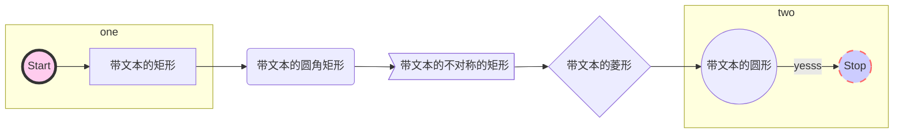
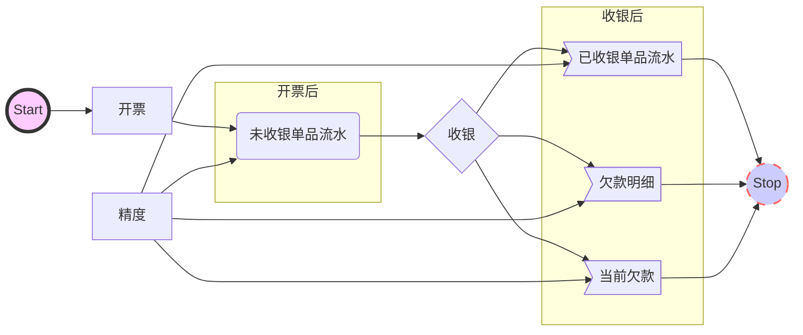

画图mermaid

- 编写思路 



流程图flow

- 编写思路：从前到后一条流的写不要断

```flow
st=>start: 开始框
op=>operation: 处理框
cond=>condition: 判断框(是或否?)
sub1=>subroutine: 子流程
io=>inputoutput: 输入输出框
e=>end: 结束框

st->op->cond
cond(no)->sub1(right)->op
cond(yes)->io->e
```



