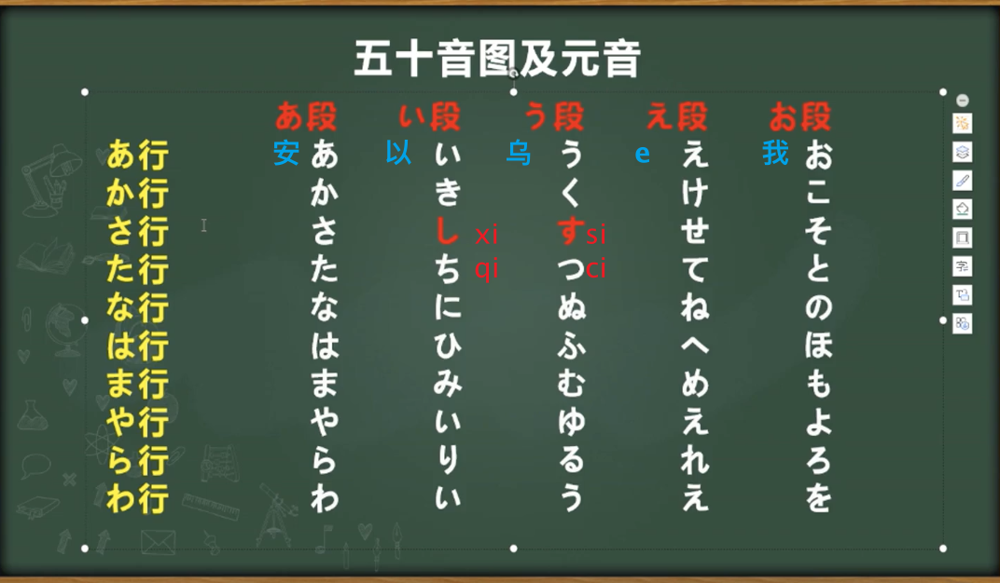
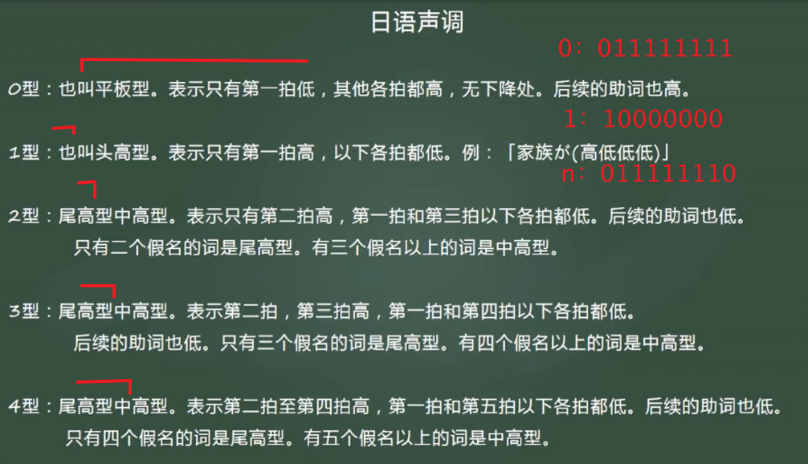
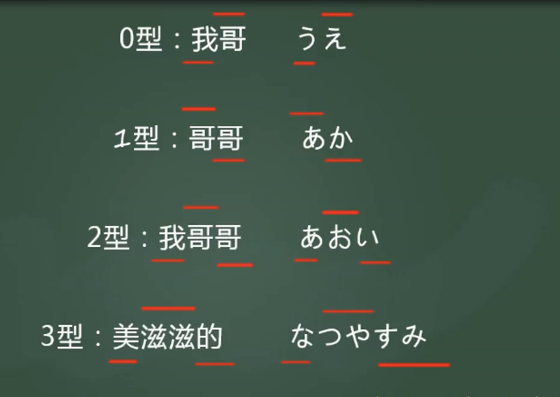
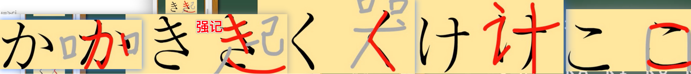
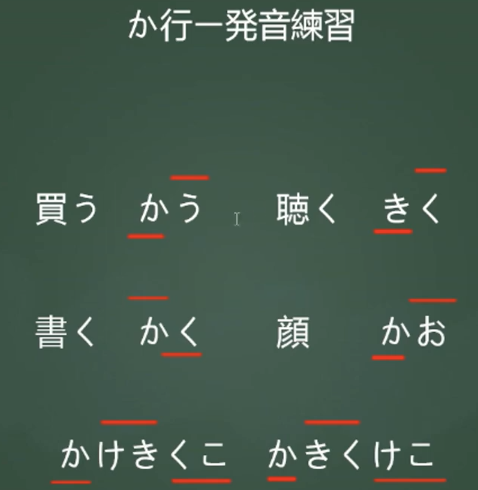
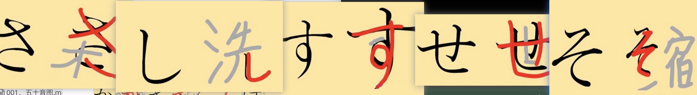
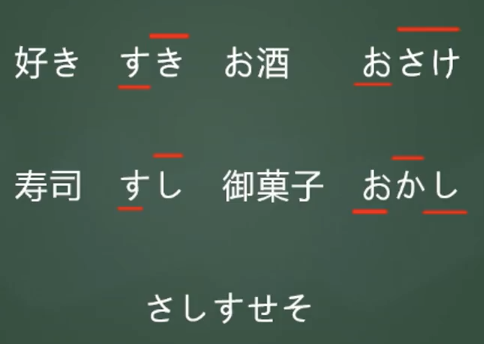
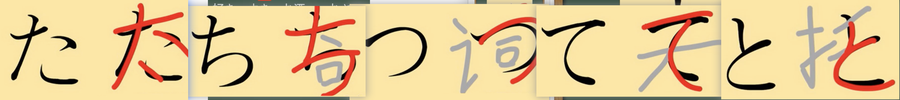
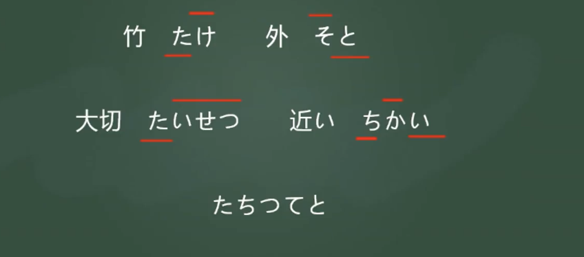
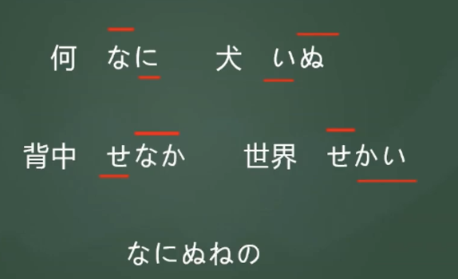

- 五十音图

> > しsi=>xu　すsu =>si　  	注意发音
> >
> > ちti=>qi			つtu=>ci
>
> > きki　さsa　ちti　らra		长得像
>
> 平假名：其他
>
> 片假名：舶来词、动物、拟声词(心跳ドキドキ)

- 音调

> 不同音调可能是不同词
>
> 橋　はし　０１
>
> 箸　はし　１０　　　筷子
>
> 暑い　	あつい　０１０
>
> 暖かい	あたたかい　０４４４０

か行

> 日文“计算”发音：計算　けいさん

> 世界　せかい　せ　se
>
> 御菓子　おかし　010

> ち　ti qi		つ　tu　 cu

> なにぬねの　　
>
> ぬ　奴 nu    

