# Appium

## inspector

- 录制功能可以用来学习api的操作代码

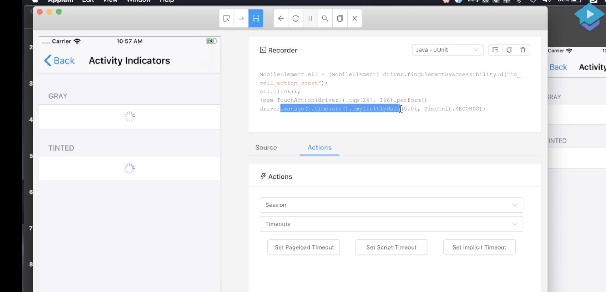

- 环境→api代码操作→框架→自动化
- 设置代理，可以监听inspector发送到appium-server的http请求

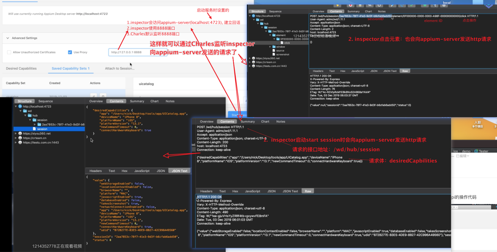


## 元素查找方法

http://appium.io/docs/en/commands/element/find-elements/

#### 基本定位

```java
# findElement：在页面上获取与定位器策略匹配的第一个元素
 MobileElement elementOne = (MobileElement)
 driver.findElementByAccessibilityId("SomeAccessibilityId")
 MobileElement elementTwo = (MobileElement)
 driver. findElementByClassName  ("SomeClassName");

# findelements：获取多个元素
 List<MobileElement> elementsOne = (List<MobileElement>)driver.findElementsByAccessibilityId ("SomeAccessibilityId") i
 List<MobileElement> elementsTwo = (List<MobileElement>)
 driver.findElementsByClassName("SomeClassName");

# API
 driver.findElement(By.foo("bar"))
 driver.findElement(MobileBy.foo("bar")  # appium 在webdriver上的扩展
 driver.findElementByFoo("bar")
```

#### findElement

##### 常规查找

```java
- id 对应元素Accessibility选项的Identifier属性，对应检查器的accessibility id
By.id("")
- name 和 accessibility id值相同
By.name("")
- className 检查器的type属性
By.className("")
- xpath appium对xpath的解析速度较慢
By.xpath("//XCUIElementTypeCell[Aname='id_cell_action_sheet']")
- 其他：ios不支持tagName、CSSSelector等定位方式

```

##### maven编译套件：指定jdk版本

除了selenium提供的定位方式，appiu有自己的扩展，需要jdk1.8及以上的jre才支持提示→指定maven项目的jdk版本为1.8→pom.xml

https://www.cnblogs.com/yanggb/p/11362091.html

```xml
<build>
    <plugins>
        <plugin>
            <groupId>org.apache.maven.plugins</groupId>
            <artifactId>maven-compiler-plugin</artifactId>
            <version>3.5.1</version>
            <configuration>
                <source>1.8</source>
                <target>1.8</target>
            </configuration>
        </plugin>
    </plugins>
</build>
```

##### MobileBy

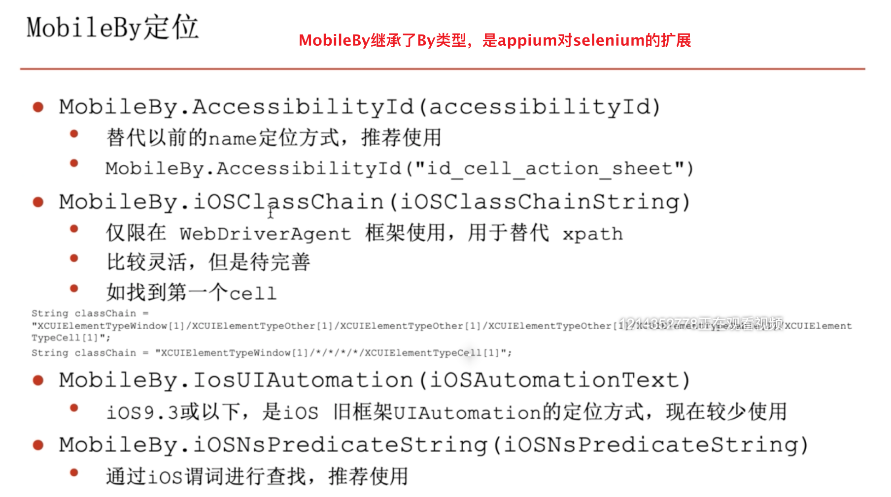

```java
// 1、AccessibilityId、替代以前的name定位方式，推荐使用;ios：name值、Android：content-desc
//driver.findElementByAccessibilityId("id_cell_action_sheet").click();
driver.findElement(MobileBy.AccessibilityId("id_cell_indicators")).click();

// 2:IosClassChain 类型链
//仅限在 WebDriverAgent 框架使用(ios10)，用于替代 xpath
//比较灵活，但是待完善，非官方开发。如找到第一个cell
//	String classChain = "XCUIElementTypeWindow[1]/XCUIElementTypeOther[1]/XCUIElementTypeOther[1]/XCUIElementTypeOther[1]/XCUIElementTypeTable[1]/XCUIElementTypeCell[3]";
//	String classChain = "XCUIElementTypeWindow[1]/*/*/*/*/XCUIElementTypeCell[4]";
		String classChain = "*/*/*/*/*/XCUIElementTypeCell[4]";  //占位符
		driver.findElementByIosClassChain(classChain).click();
		driver.findElement(MobileBy.iOSClassChain(classChain)).click();
```


##### 谓词-iOSNsPredicate

- 使用的是IOS编程语言的谓词功能

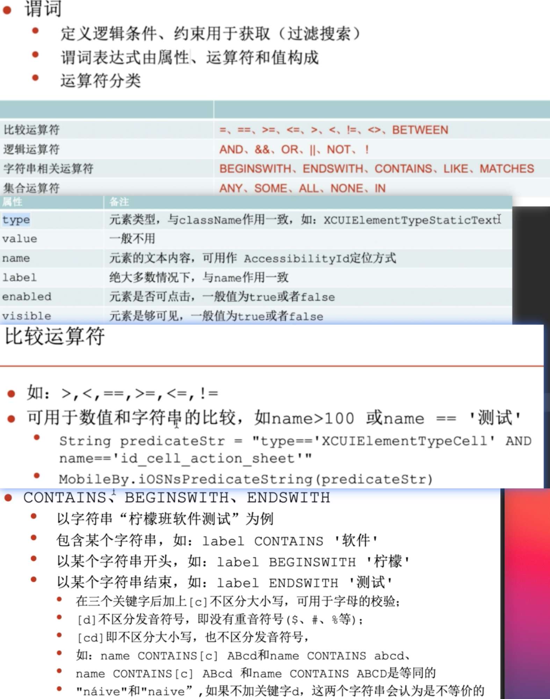

```java
//String predicateStr = "name CONTAINS[c] 'Action'";
//String predicateStr = "name BEGINSWITH 'id_cell_action'";
//String predicateStr = "name ENDSWITH 'cell_btn'";
//String predicateStr = "name = 'id_cell_action_sheet'";
//String predicateStr = "name IN {'id_cell_action_sheet','id_cell_indicators','id_cell_alert66666'}";
driver.findElementByIosNsPredicate(predicateStr).click();
List<IOSElement> elements = driver.findElements(MobileBy.iOSNsPredicateString(predicateStr));

```


```java
/**
* 4：模糊匹配：LIKE，?代表一个字符，*代表多个字符,通配符也接受[cd]

如：一个元素的label属性为：柠檬班软件测试
label LIKE '柠檬班软件测试'
label LIKE '柠檬班?件测试'
label LIKE '柠檬班??测试'
label LIKE '柠檬?软?测试'
label LIKE '*软件测试'
label LIKE '柠檬班*'
label LIKE '柠檬*测试'
label LIKE '柠*软*试'
*/
//id_cell_action_sheet
String predicateStr1 = "name LIKE 'id_????_action_sh*t'";		System.out.println(driver.findElements(MobileBy.iOSNsPredicateString(predicateStr1)).size());

String predicateStr = "name LIKE[c] '*View'";//9个	
String predicateStr = "name LIKE[c] '*View'";//4个，区分大小写
System.out.println(driver.findElements(MobileBy.iOSNsPredicateString(predicateStr)).size());
		
/**
* 5：正则表达式：MATCHES
*/
//id_cell_action_sheet
//id_cell_alert
String predicateStr = "name MATCHES '^i.+t$'";
List<IOSElement> elements = driver.findElements(MobileBy.iOSNsPredicateString(predicateStr));
//System.out.println(elements.size());
//		if (elements.size()>0) {
//			elements.get(1).click();
//		}
		
/*
* 6:逻辑运算符
* AND、&&、OR、||、NOT、 !
*/
String predicateStr = "name = 'id_cell_action_sheet' || name == 'id_cell_alert'";
String predicateStr = "name = 'id_cell_action_sheet' OR name == 'id_cell_alert'";
String predicateStr = "name = 'id_cell_action_sheet' AND type == 'XCUIElementTypeCell'";
String predicateStr = "name = 'id_cell_action_sheet' && type == 'XCUIElementTypeCell'";
List<IOSElement> elements = driver.findElements(MobileBy.iOSNsPredicateString(predicateStr));
System.out.println(elements.size());
elements.get(0).click();
		

```


#### IOSDriver-API

```java
import org.openqa.selenium.remote.DesiredCapabilities;
import io.appium.java_client.ios.IOSDriver;
import io.appium.java_client.ios.IOSElement;

//会话
// 		1:创建会话
IOSDriver<IOSElement> driver = new IOSDriver<IOSElement>(remoteAddress, desiredCapabilities);    
//		2:状态信息status
Map<String, Object> infoMap = driver.getStatus();
//> {build={version=1.18.3}}  //appium版本
// 		3:获取会话的id
SessionId sessionId = driver.getSessionId(); 
//System.out.println(sessionId);
driver.quit();//	4:结束会话	
//		5:获取源代码（获取网页源码：程序层次结构XML (app)或页面源码(web)）
String pageSource = driver.getPageSource();  
//System.out.println(pageSource);	
//		6:返回（只适合web上下文）AndroidDriver才有
AndroidDriver<AndroidElement> aDriver = null;
aDriver.navigate().back();    


//执行mobile命令
//语法 driver.executeScript("mobile:<commandName>".<JSON serializable参数>)
String command = "mobile: scroll"
Map<String, Object> params = new HashMap<String, Object>();
params.put("direction", "down");
driver.executeScript(command, params); 


//截屏 IOSDriver继承了RemoteWebDriver类，而RemoteWebDriver实现了TakesScreenshot接口
File sourceFile = ((TakesScreenshot)driver).getScreenshotAs(OutputType.FILE);
FileUtils.copyFile(sourceFile, new File("/Users/nick/Desktop/1.jpg"));
//OutputType有多种输出格式，FILE源文件可以直接写入本地，BASE64文本可以存入数据库、BYTES字节数组支持像reportng,allure等打开


//延时等待
		//1:硬性等待、线程等待、线程休眠
Thread.sleep(3000);
driver.findElement(By.id("id_cell_action_sheet")).click();		
		//2:隐式等待:全局元素生效，只在pagesauce源代码接口中（DOM结构中）找
driver.manage().timeouts().implicitlyWait(10, TimeUnit.SECONDS);
driver.findElement(By.id("id_cell_action_sheet_6666")).click();		
		//3:显式等待、智能等待:推荐使用，不会浪费时间，找到了立马执行。selenium继承过来的
WebDriverWait wait = new WebDriverWait(driver, 10);
IOSElement element = wait.until(new ExpectedCondition<IOSElement>() {
			@Override
			public IOSElement apply(WebDriver input) {
				System.out.println("-------------------------");
				return driver.findElement(By.id("id_cell_action_sheet_6666"));
			}
//WebDriverWait().until(ExpectedConditions.xxxx)
  //ExpectedConditions 这个工具类有很多智能等待的期望条件
WebElement element = wait.until(ExpectedConditions.visibilityOfElementLocated(By.id("id_cell_action_sheet")));
element.click();


//屏幕设置
//		1:设置为横向 PORTRAIT
driver.rotate(ScreenOrientation.PORTRAIT);
//		2:获取设备方向 getOrientation
ScreenOrientation orientation = driver.getOrientation();
//System.out.println(orientation.name());
//System.out.println(orientation.value());
Thread.sleep(3000);
//		3:设置设备方向 LANDSCAPE
driver.rotate(ScreenOrientation.LANDSCAPE);
ScreenOrientation orientation2 = driver.getOrientation();
System.out.println(orientation2.name());
System.out.println(orientation2.value());
  
//设备相关
//		1:抖动 driver.shake();
driver.shake();
//		2:锁定设备 driver.lockDevice();
System.out.println(driver.isDeviceLocked());
Thread.sleep(2000);
driver.lockDevice();
//		3:解锁设备 driver.unlockDevice();
System.out.println(driver.isDeviceLocked());
Thread.sleep(3000);
driver.unlockDevice();
//		4:检查设备是否锁定 driver.isDeviceLocked();
Boolean isDeviceLocked = driver.isDeviceLocked();
System.out.println(isDeviceLocked);
//键盘
		// 软键盘是否显示
System.out.println(driver.isKeyboardShown());
driver.findElementByAccessibilityId("id_cell_text_fields").click();
IOSElement element = driver.findElementByAccessibilityId("id_tv_default");
element.click();
element.sendKeys("123456");
		// 软键盘是否显示 isKeyboardShown()
System.out.println(driver.isKeyboardShown());
		// 隐藏软键盘 .hideKeyboard()
Thread.sleep(3000);
driver.hideKeyboard();
```

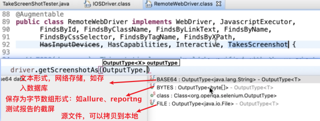

ios需要打开Settings>Developer>Enable UI Automation 才能支持UI层次的自动化

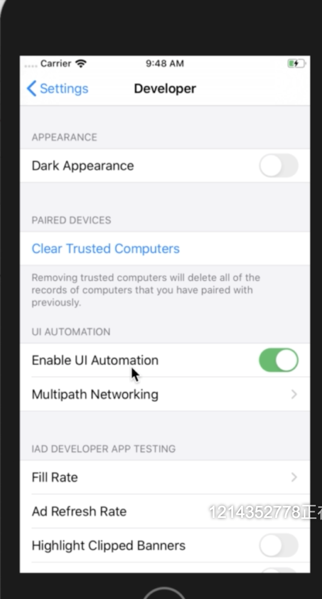

自动化测试最好关闭键盘的自动纠正和预测输入：Settings>Genaral>Keyboard>Auto-Correction、Predictive

mac模拟器切换软键盘和实体键盘：Hardwara>Keyboard>Toggle Software Keyboard 

##### Element-Api-Action

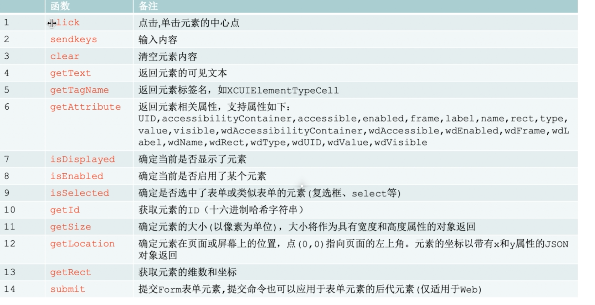

click() 单击元素中心位置：元素没有被其他元素遮挡、是可见的、enable状态：：否则报不可交互异常

sendKeys("string")，有些版本的模拟器、appium会很慢

- 曲线救国：element.setValue("string")

clear()，有些版本不生效

- 曲线救国：退格键、点击虚拟键盘的退格键

##### Element-Api-GetInfo

```java
//		4		getText		返回元素的可见文本
		System.out.println(element.getText());//Action Sheets
//		5		getTagName		返回元素标签名，如XCUIElementTypeCell
		System.out.println(element.getTagName());//XCUIElementTypeStaticText
//		6		getAttribute		返回元素相关属性，支持属性如下：
//	UID,accessibilityContainer,accessible,enabled,frame,label,name,rect,type,value,visible,wdAccessibilityContainer,wdAccessible,wdEnabled,wdFrame,wdLabel,wdName,wdRect,wdType,wdUID,wdValue,wdVisible
		System.out.println(element.getAttribute("enabled"));//true
//		7		isDisplayed		确定当前是否显示了元素
		System.out.println(element.isDisplayed());//true
//		8		isEnabled		确定当前是否启用了某个元素
		System.out.println(element.isEnabled());//true
//		9		isSelected		确定是否选中了表单或类似表单的元素(复选框、select等)
		System.out.println(element.isSelected()); //
//		10		getId		获取元素的ID（十六进制哈希字符串）
		System.out.println(element.getId());//27000000-0000-0000-4A21-000000000000
//		11		getSize		确定元素的大小(以像素为单位)，大小将作为具有宽度和高度属性的对象返回
		Dimension dimension = element.getSize();
		System.out.println(dimension.getWidth()+","+dimension.getHeight());//119,24
//		12		getLocation		确定元素在页面或屏幕上的位置，点(0,0)指向页面的左上角。元素的坐标以带有x和y属性的JSON对象返回
		Point point = element.getLocation();
		System.out.println(point.getX()+","+point.getY());//18,82
//		13		getRect		获取元素的维数和坐标
		Rectangle rectangle = element.getRect();
		System.out.println(rectangle.x);//18
		System.out.println(rectangle.y);//82
		System.out.println(rectangle.getWidth());//119
		System.out.println(rectangle.getHeight());//24

```

##### App-Api

```java
//		1:安装应用		
driver.installApp("/Users/happy/Desktop/tools/app/UICatalog.app");
//		2:查看应用是否安装	已安装则返回true
boolean flag = driver.isAppInstalled(bundleId);
System.out.println(flag);
//		3:启动应用 		
driver.launchApp();	
//		4：将应用退出到后台，参数为退出到后台的时间
driver.runAppInBackground(Duration.ofSeconds(5L));
//		5：直接关闭应用 		
driver.closeApp();
//		6：重置应用程序
driver.resetApp();
//		7：移除应用		成功移除则返回true
driver.removeApp(bundleId);
System.out.println(driver.isAppInstalled(bundleId));
//		9：退出应用		成功退出正在运行的App返回true
driver.terminateApp(bundleId);
//		8：激活应用
driver.activateApp(bundleId);
//		10：查看应用状态 	返回ApplicationState
ApplicationState state = driver.queryAppState(bundleId);
System.out.println(state);
App的bundleId
//ApplicationState，如NOT_RUNNIN
//		12-:使用命令（只有XCUITest才支持）
Map<String, Object> appParams = new HashMap<String, Object>()	;
params.put("app", "/Users/happy/Desktop/tools/app/UICatalog.app");
Map<String, Object> bundleIdParams = new HashMap<String, Object>();
params.put("bundleId", bundleId);

driver.executeScript("mobile: installApp",appParams);	//		安装应用
driver.executeScript("mobile:isAppInstalled",bundleIdParams);	//		查看应用是否安装 		true：已安装
driver.executeScript("mobile:launchApp",bundleIdParams);		//		启动应用
driver.executeScript("mobile: removeApp",bundleIdParams);		//		移除应用		true:移除成功
driver.executeScript("mobile:activateApp",bundleIdParams);	//		激活应用
driver.executeScript("mobile:terminateApp",bundleIdParams);	//		退出应用		
// true:正在运行的App成功退出
driver.executeScript("mobile:queryAppState",bundleIdParams);	//		查看应用状态
//		0:当前应用程序状态无法确定或未知
//		1:应用没有运行
//		2:应用后台运行且被挂起
//		3:应用后台运行但没挂起
//		4:应用前台运行
```

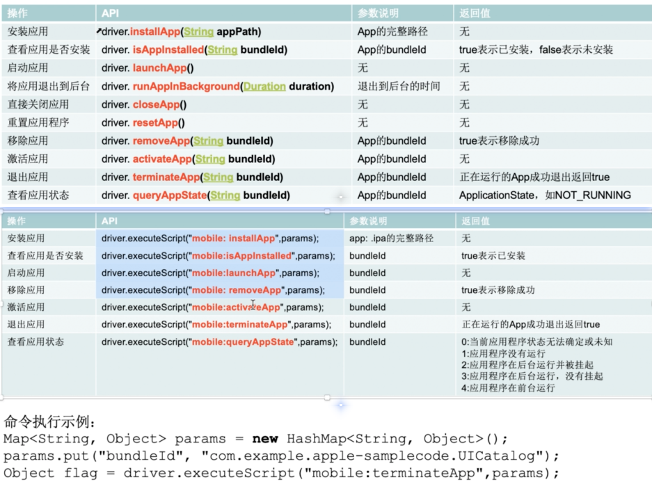


##### Gesture

- scroll   ： 滚动滚动条
- swipe  ：滑动屏幕

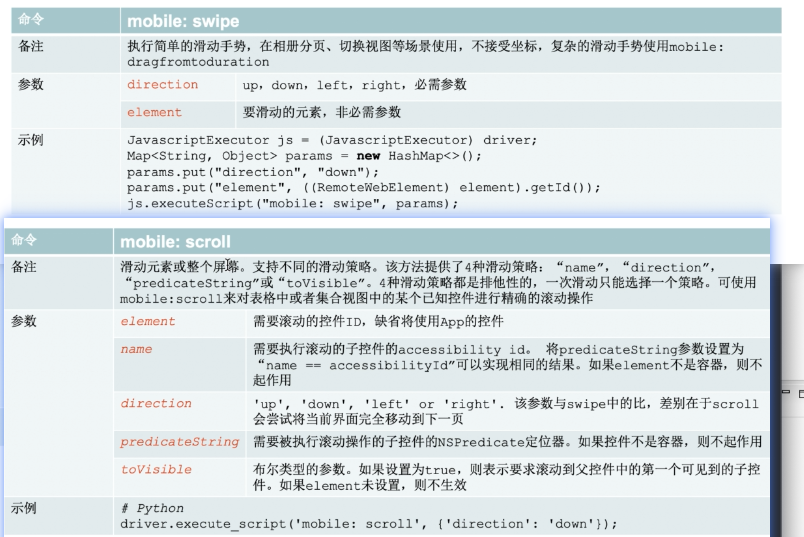

```java
		/**
		 命令		mobile: swipe
		执行简单的滑动手势，在相册分页、切换视图等场景使用，不接受坐标，复杂的滑动手势使用mobile: dragfromtoduration 
		direction：up，down，left，right 		必需参数
		element 		要滑动的元素，非必需参数
		 */
		//示例
JavascriptExecutor js = (JavascriptExecutor) driver;
Map<String, Object> params = new HashMap<>();
params.put("direction", "down");		//点击屏幕下拖（页面上滑
params.put("element", ((RemoteWebElement) element).getId());
js.executeScript("mobile: swipe", params);

				/**
		 * mobile: scroll
			滑动元素或整个屏幕。支持不同的滑动策略。该方法提供了4种滑动策略：“name”，“direction”，“predicateString”或“toVisible”。4种滑动策略都是排他性的，一次滑动只能选择一个策略。可使用mobile:scroll来对表格中或者集合视图中的某个已知控件进行精确的滚动操作
			element  需要滚动的控件ID，缺省将使用App的控件
			name  需要执行滚动的子控件的accessibility id。 将predicateString参数设置为“name == accessibilityId”可以实现相同的结果。如果element不是容器，则不起作用
			direction   'up', 'down', 'left' or 'right'. 该参数与swipe中的比，差别在于scroll会尝试将当前界面完全移动到下一页
			predicateString   需要被执行滚动操作的子控件的NSPredicate定位器。如果控件不是容器，则不起作用
			toVisible   布尔类型的参数。如果设置为true，则表示要求滚动到父控件中的第一个可见到的子控件。如果element未设置，则不生效
			
			示例
			# Python 
			driver.execute_script('mobile: scroll', {'direction': 'down'});
*/
Map<String,Object> params = new HashMap<String, Object>();
params.put("element", ((RemoteWebElement) element).getId());
params.put("direction", "down");    // 对比swipe，其将当前页完全移动到下一页（滚动条下滚）
params.put("name", "accessibilityId");
params.put("predicateString", "name == accessibilityId");
params.put("toVisible", true);    //需要设置element才能用，滚动到
driver.executeScript("mobile: scroll", params);
		 
```

- 缩放：pinch scale  	0-1缩小，>1放大。scale 0-1时velocity必须0

- tap、doubleTap、touchAndHold  	  x、y在没有指定element时强制  

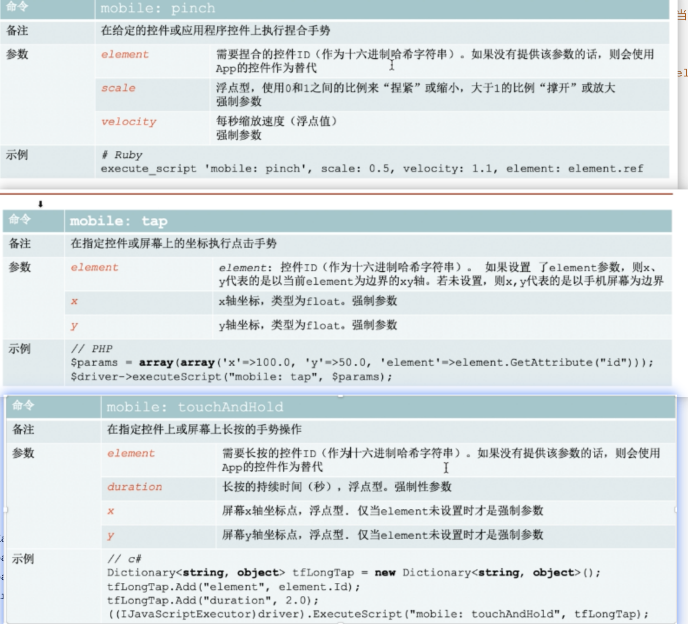

```java
desiredCapabilities.setCapability(MobileCapabilityType.BROWSER_NAME, MobileBrowserType.SAFARI);	
/**
		 * 命令
		mobile: pinch		在给定的控件或应用程序控件上执行捏合手势
		element		需要捏合的控件ID（作为十六进制哈希字符串）。如果没有提供该参数的话，则会使用App的控件作为替代
		scale 		浮点型，使用0和1之间的比例来“捏紧”或缩小，大于1的比例“撑开”或放大
		velocity 	每秒缩放速度（浮点值） 强制参数
		示例
		# Ruby 
		execute_script 'mobile: pinch', scale: 0.5, velocity: 1.1, element: element.ref
		 */
Map<String,Object> params = new HashMap<String, Object>();
params.put("scale", 0.5);
params.put("velocity", -2.0);//velocity must be less than zero when scale is less than 1
driver.executeScript("mobile: pinch", params);

//tap
IOSElement btn = driver.findElementByAccessibilityId("id_cell_btn");
Map<String, Object> params = new HashMap<String, Object>();
//params.put("element", btn.getId());
params.put("x", 10.0);
params.put("y", 10.0);
driver.executeScript("mobile: doubleTap", params);

//touchAndHold
Map<String,Object> params = new HashMap<String, Object>();
params.put("duration", 2.0);
params.put("x", 184.0);
params.put("y", 164.0);
driver.executeScript("mobile: touchAndHold", params);
```

- 拖动

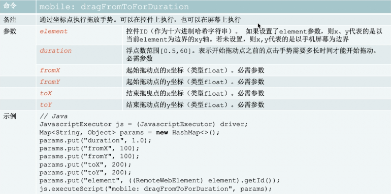

- PickerView

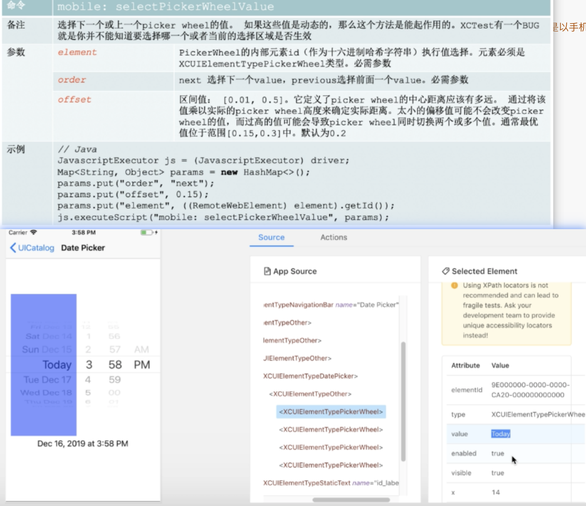

```java
/*通过坐标点执行拖放手势。可以在控件上执行，也可以在屏幕上执行
element 		控件ID（作为十六进制哈希字符串）。 设置element则x、y是以element为边界的xy轴。未设置则x,y是以手机屏幕为边界
duration 		浮点数范围[0.5,60]。表示开始拖动点之前的点击手势需要多长时间才能开始拖动。		必需参数
fromX		起始拖动点的x坐标（类型float）。必需参数
fromY		起始拖动点的y坐标（类型float）。必需参数
toX		结束拖曳点的x坐标（类型float）。必需参数	
toY		结束拖动点的y坐标（类型float）。必需参数
*/
Map<String, Object> params= new HashMap<String, Object>();
params.put("duration", 0.5);
params.put("fromX", 155.0);
params.put("fromY", 400.0);
params.put("toX", 155.0);
params.put("toY", 300.0);
driver.executeScript("mobile: dragFromToForDuration", params);

//selectPickerWheelValue
/*选择下/上一个picker wheel的值。 如果这些值是动态的那么这个方法是能起作用的。XCTest有一个BUG就是你并不能知道要选择哪一个或者当前的选择区域是否生效
element:  PickerWheel的内部元素id（作为十六进制哈希字符串）执行值选择。元素必须是XCUIElementTypePickerWheel类型。必需
order:  next 选择下一个value，previous选择前面一个value。必需
offset:	区间值： [0.01, 0.5]。定义PickerWheel中心距离应该有多远。通过将该值乘以实际的picker wheel高度来确定实际拖动距离。太小的偏移值可能不会改变picker wheel的值，而过高的值可能会导致picker wheel同时切换两个或多个值。通常最优值位于范围[0.15,0.3]中。默认为0.2
*/
IOSElement pickerWheel = driver.findElement(By.xpath("//xxxxx...")); 
Map<String, Object> params= new HashMap<String, Object>();
params.put("element", pickerWheel.getId());
params.put("order", "next");
params.put("offset", 0.1);
for (int i = 0; i < 10; i++) {
	Thread.sleep(1000);
	driver.executeScript("mobile: selectPickerWheelValue", params);
}
		
```


- Gestures_alert

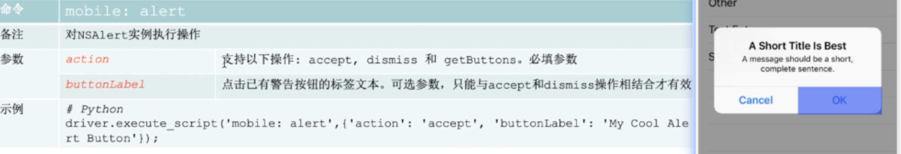

```java
Map<String, Object> params= new HashMap<String, Object>();
params.put("action", "accept");
params.put("action", "dismiss");
params.put("action", "getButtons");
Object object = driver.executeScript("mobile: alert", params);
System.out.println(object);
//也可以直接定位后点击
```

