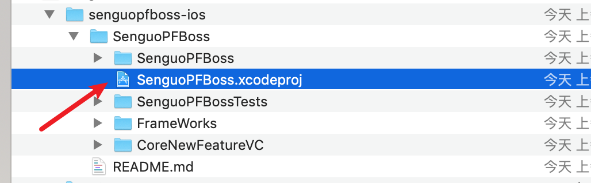
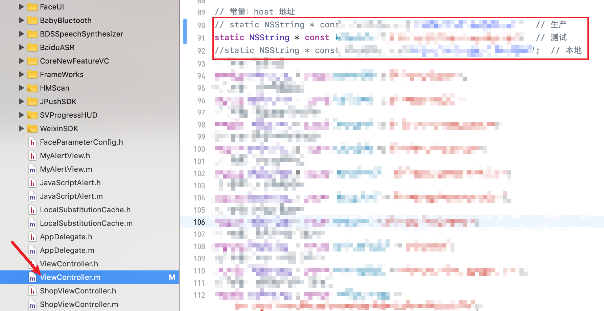
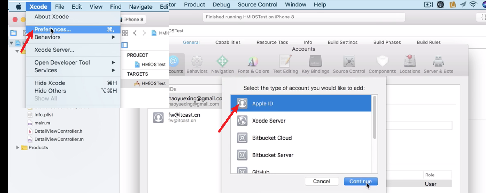
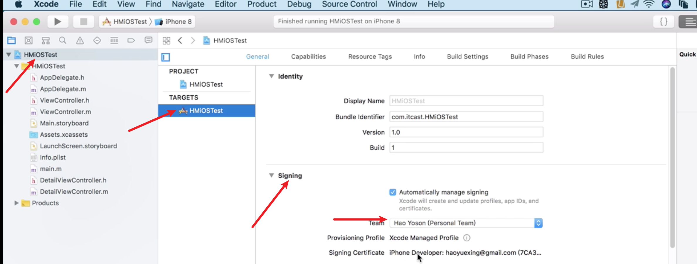
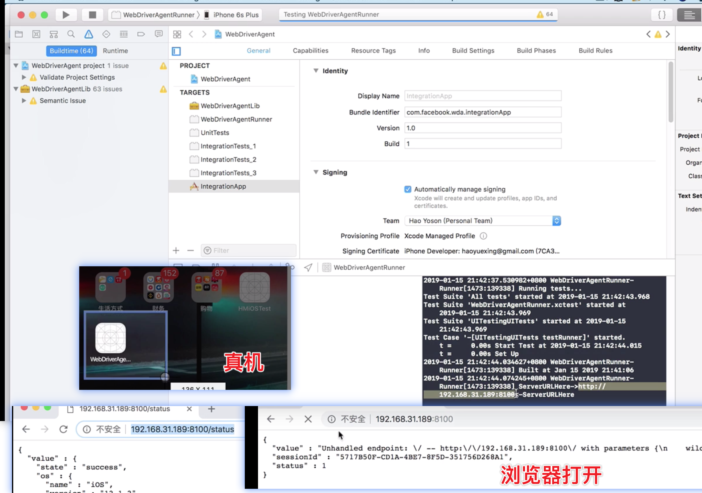
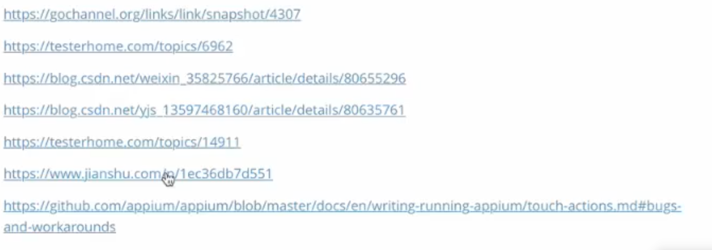

# IOS 自动化测试

推荐：https://www.jianshu.com/p/38e6d7318ebf


## 学习目标：

1. 能够搭建IOS自动化测试所需要的环境
2. 能够使用模拟器进行IOS自动化测试   
3. 能够使用真机进行IOS自动化测试

https://www.bilibili.com/video/BV1tT4y137bD?p=7&spm_id_from=pageDriver

## 一.  环境搭建

### 应用场景

想进行ios自动化测试，必须进行环境的搭建

### 需要的环境

- [ ] macOS 系统的电脑
- [ ] Xcode   (Mac OS X上的集成开发工具（IDE）
- Version 12.4 (12D4e)
- [ ] 待测试的ios项目
- 从coding上复制仓库地址克隆下来
- [ ] appium desktop
  - https://github.com/appium/appium-desktop/releases
  - 1.18.3
- [ ] Python3
  - 3.7 	https://www.python.org/ftp/python/
- [ ] pycharm（python IDE
  - CE	即可  https://www.jetbrains.com/pycharm/download
- [ ] nvm 

```
brew install nvm 
# 设置环境变量
```

- [ ] node.js（基于Chrome V8引擎的JavaScript运行环境，我们主要用它提供的npm
  
  - https://npm.taobao.org/mirrors/node/
  
  - ```
    nvm 
    ```
  
    
  
- [ ] cnpm  (npm限速，可用这个工具替代

  - 5.2.0

  ```shell
  npm install -g cnpm --registry=https://registry.npm.taobao.org
  ```

- [ ] ios-deploy 依赖库（用于ios测试

  ```shell
  cnpm install -g ios-deploy
  ```

  - xcode不在默认路径的解决方法

- [ ] brew  (max os 的包管理软件，可用macOS自带的ruby安装，不过一般maxOS已经自带了

  ```
  # 没试过
  ruby -e "$(curl -fsSL https://raw.githubusercontent.com/Homebrew/install/master/install)"
  ruby <(curl -fsSKL raw.github.com/mxcl/homebrew/go)
  ```

- [ ] libimobile 依赖库（用于真机调试，检索ios设备

  ```
  brew install --HEAD libimobiledevice
  ```

  - 可能出现的问题-依赖项版本太低
    - 报错：Requested "libusbmuxd> =1. 1. But version of libusbmuxd is 1.0.10 

    - 解决方法

    - ```shell
      brew update
      brew uninstall --ignore-dependencies libimobiledevice  
      brew uninstall --ignore-dependencies usbmuxd  
      brew install --HEAD usbmuxd  
      brew unlink usbmuxd  
      brew link usbmuxd
      brew install --HEAD libimobiledevice
      ```

- [ ] carthage 依赖库（WebDriver Agent需要用carthage来自动下载一些内容

  ```shell
  brew install carthage
  ```

- [ ] IOS 手机

- [ ] Apple ID 
  - https://appleid.apple.com/account#!&page=creat
  - 使用xcode真机调试需要登录你的AppleID，要运行ios项目需要将AppleID添加到对应的开发着团队（现在苹果官方好像有所放开了，一些应用没有开发者身份也能运行）

- [ ] WebDriverAgent（用于调用苹果官方自动化测试框架Uiautomation，appium则调用WebDriverAgent
  - https://github.com/facebook/WebDriverAgent
  - 
  - 解压得到WebDriverAgent-master
  
- appium-doctor

  - ```
    npm install -g appium-doctor
    ```

    

## 二. 使用模拟器进行自动化测试

### 2.1 运行ios程序到模拟器

1. 使用xcode打开要运行的程序

   1. 

2. 选择要运行的程序和模拟器设备

   1. 

3. 运行 △、或者comand+r

   ps：修改host：

### 2.2 查看ios元素特征

步骤：

1. 打开appium→启动appium→屏幕左上角菜单栏::Appium>New Session Window

2. 设置Desired Capabilities并start Sessoion

   ```
   {
   "platformName":"ios",
   "platformVersion":"13.3",
   "deviceName":"iPhone 11",
   "app":"cc.senguo.SenguoPFBossApp"
   }
   
   ```

   platformVersion：模拟器边缘有写

   deviceName：不想安卓，这里必须严格填写

   app：包名xcode点到项目根目录-General-Bundle Identifie

3. 启动
   - 采坑：找不到xcode的解决方法
     - 
   - 如果启动失败，提示stale element reference: element is not attach
     - 可以重启模拟器


### 2.3 编写和运行自动化脚本

- 前置代码

```
import time

from appium import webdriver

desired_caps = dict()
desired_caps["platformName"]="ios"
desired_caps["platformVersion"]="13.3"
desired_caps["deviceName"] ="iPhone 11"
desired_caps["app"] ="cc.senguo.SenguoPFBossApp"

# 启动app
driver = webdriver.Remote('http://127.0.0.1:4723/wd/hub',desired_caps)

# ui操作
# driver.tap([(57,819)],200)  # 按下
# driver.find_element_by_xpath().click()  # 点击
# 经验01 安卓中只查找屏幕上显示的控件，ios中则还能能找到屏幕外延的
# 不过要点击的话，还是需要显示在屏幕上
# driver.swipe() # 滑动，不好使时可以用js代码：
	# driver.execute_script("console.log('执行js代码')") # 执行js代码
	# driver.execute_script("mobile: scroll",{"direction":"down"})
	# driver.execute_script("mobile: swipe",{"direction":"up"})
# 元素特征相比于安卓不同的：# class→type 、text→name、

# driver.find_element_by_xpath().clear() # 清空文本框
# driver.find_element().send_keys() # 输入文字
# 经验02 有时候send_keys、clear一类对输入框操作的方法需要在虚拟键盘唤起时才能正常使用。模拟器如果启用了实体键盘可
# 能会导致不能唤起虚拟键盘从而导致appium无法正常工作

# 退出
time.sleep(5)
print("+++")
driver.quit()
```

- 如果端口4723被其他程序占用，可能会导致脚本因为session无法建立而报错


总结：2.1：配置环境，保证被测程序运行在模拟器上；2.2：使用appium获取元素特征，使用pycharm编写脚本


## 三、使用真机进行自动化测试

### 3.1 运行ios程序到真机

在Xcode登录AppleID→配置开发者信息→选择要运行的程序和设备→运行→手机::设置>通用>设备管理>自己的AppleId-信任程序→重新运行

1. 在Xcode登录AppleID
   1. 
2. 配置开发者团队信息
   1. 
3. 选择要运行的程序和设备→运行→手机::设置>通用>设备管理>自己的AppleId-信任程序→重新运行

### 3.2 配置WebDriverAgent

1. 进入WebDriverAgent目录，输入命令启动bootstrap.sh：./Scripts/bootstrap.sh

   1. ```
      # 长期替换(建议使用此项配置)  
      echo 'export HOMEBREW_BOTTLE_DOMAIN=https://mirrors.tuna.tsinghua.edu.cn/homebrew-bottles'>>   ~/.bash_profile   
      
      #执行.bash_profile脚本让配置即时生效
      source ~/.bash_profile   
      ```

      

2. 启动WebDriverAgent.xcodeproj，配置以下target的开发者信息：WebDriverAgentLib、WebDriverAgentRunner、IntegrationApp

3. 根据2中的报错信息修改WebDriverAgentRunner、IntegrationApp 两target 的product bundle identifier

   1. 

4. 连接真机，选择程序WebDriverAgentRunner和真机在xcode终端中conmand+u运行
   1. 终端log会打印出一个url地址，电脑用浏览器访问可以显示一个json数据，并且真机会多一个WebDriverAgent的程序
      1. 

5. 替代appium的WebDriverAgent驱动

   1. 打开finder→conmand+shift+g>输入路径：输入路径 /Applications/Appium.app/Contents/Resources/app/node_modules/appium-xcuitest-driver→备份原文件及并移入配置好的Facebook-WebDriverAgent
      1. 注意，不同版本的appium可能是不同路径
      2. /Applications/Appium.app/Contents/Resources/app/node_modules/appium-webdriveragent

### 3.3 运行脚本

```
desired_caps["udid"] = "a4485fabb6c524aca88551388f334579ce8a760f"
```




### 4 独立

安装brew

安装nvm(node的包管理工具)，配置环境变量

使用nvm安装node：nvm ls-remote     nvm install v......

安装appium-doctor

```
npm install -g appium-doctor
```

运行appium-doctor 完成环境安装


cap文件：

ios-xcuitest-real-devicesmd


brew install libimobiledevice --HEAD

banbenbugou.png


brew install iOS-deploy   》获取bundle_id

- ios-deploy -h
- ios-deploy --list_bundle_id |grep senguo