## 一、环境安装

#### 其他资源


- [ ] Apple ID 

  - https://appleid.apple.com/account#!&page=creat
  - 使用xcode真机调试需要登录你的AppleID，要运行ios项目需要将AppleID添加到对应的开发着团队（现在苹果官方好像有所放开了，一些应用没有开发者身份也能运行）
- [ ] 待测试的ios项目

  - 从coding上复制仓库地址克隆下来
- [ ] mac电脑

#### 测试环境

- [ ] java   → https://repo.huaweicloud.com/java/jdk/  注意配置JAVA_HOME环境变量

    ```shell
    # 并非这个
    which java
    > /usr/bin/java
    # 设置bash的环境变量
    vim ~/.bash_proofile
    # 内容 实际安装的目录
    JAVA_HOME = /Library/Java/JavaVirtualMachines/jdk..../Contents/Home
    PATH=$PATH:$JAVA_HOME/bin
    export JAVA_HOME
    export PATH
    
    source ~/.bash_profile
    echo $JAVA_HOME
    ```


- [ ] python3.7 → https://www.python.org/ftp/python/
- [ ] pip3    pip 21.0.1 from /usr/local/lib/python3.9/site-packages/pip (python 3.7安装后自带的包管理工具
- [ ] pycharm（python IDE→ https://www.jetbrains.com/pycharm/download，CE即可


- [ ] xcode       (ios应用的ide  Version 12.4 (12D4e)→ mac商店下载
  
- 快捷键https://www.jianshu.com/p/f5f4e8a3e97c?nomobile=yes
  
- [ ] Homebrew	（mac的包管理工具 https://brew.sh

    ```shell
    # max os 的包管理软件，一般maxOS已经自带了
    # 可用macOS自带的ruby安装，推荐版本Homebrew 3.0.5(没试过
    # 安装
    ruby -e "$(curl -fsSL https://raw.githubusercontent.com/Homebrew/install/master/install)"
    # 验证
    brew -v
    # 更新
    brew update && brew upgrade && brew clean
    
    # 其他安装方式
    ruby <(curl -fsSKL raw.github.com/mxcl/homebrew/go)
    ```


- [ ] nvm    （node.js版本管理软件， 

- [ ] node.js    （基于Chrome V8引擎的JS运行环境
    
- [ ] npm    （NodeJs一起安装的包管理工具
    
- [ ] cnpm    (npm下载包时会有网络问题，可用这个工具替代https://npm.taobao.org
    
   ```shell
   # 安装nvm
   brew install nvm
   # 然后根据安装成功后打印的信息配置环境变量
   nvm ls-remote     
   # 选择debanium的最新版的node.js安装
nvm install 版本号
   
   # 安装NodeJs 也可以直接用brew下载node.js
   brew install node
   # node提供了npm工具，不过也可由用brew下载
   brew install npm
   
   # 验证 -v
   
   # cnpm  
   npm install -g cnpm --registry=https://registry.npm.taobao.org
   ```


- [ ] 其他 ios测试需要的依赖

  ```shell
  # libimobiledevice (类似Android的adb命令工具，用于真机调试，获取ios设备信息
  # 1ibimobiledevice 是一个使用原生协议与苹果主ios设备进行通信的库  # Applum 连接ios设备必需要的依赖库
  # 通过这个库MacOs可轻松获得1OS设备信息
  brew install --HEAD libimobiledevice
  
  # ideviceinstaller（是一个管理连接设备的工具，类似于Android的adb，与ios-deploy类似
  # 作用：获取设备udid、安装卸载app、获取bundleid
  # 注意点：仅在ios9工作
  brew install ideviceinstaller
  
  # ios-deploy（mac不依赖xcode的调试工具(是一个使用命令行安装ios app到已连接设备的工具
  # 原理:根据os ⅹ命令行调用系统底层函数,获取连接的设备、査询/安装/卸载app
  # 注意点：iOS10+的系统上使用 appium，则需要安装 ios-dep1oy
  brew install ios-deploy
  cnpm install -g ios-deploy
  npm install -g ios-deploy
  
  # carthage(一款ios项目依赖管理工具，和Cocoapods有相似的功能
  # 类似于maven之于java project，WebDriverAgent通过carthage管理项目依赖
  brew install carthage
  # 验证
  carthage version
  
  # usbmuxd（用于在USB协议上实现多路TCP连接，主要用它提供的iproxy
  brew install usbmuxd
  ```


  - xcode不在默认路径的解决方法 
    
  - 
  - 安装libimobiledevice可能的报错

    ```shell
     # 依赖包libusbmuxd版本太低
     # 报错：
     Requested "libusbmuxd> =1. 1. But version of libusbmuxd is 1.0.10 
     # 解决方法
     brew update
     brew uninstall --ignore-dependencies libimobiledevice  
     brew uninstall --ignore-dependencies usbmuxd  
     brew install --HEAD usbmuxd  
     brew unlink usbmuxd  
     brew link usbmuxd
     brew install --HEAD libimobiledevice
     
     # 因为没有安装git导致安装失败
     brew install git
     brew install --HEAD libimobiledevice
     # 如果继续报错，尝试设置git的ssl校验为false
     git config --global http.sslVerify false
     brew install --HEAD libimobiledevice
    
    
    ```

- [ ] appium   http://www.appium.io/


- 安装 Apium 命令行版本：优点::可以开启多设备的自动化测试

```shell
 brew install node 			# get node.js
 npm install -g appium 	# get appium
 npm install wd 				# get appium client
 apium &								# start appium
 node your-appium-test.js
 # 命令行打开Appium 监听 4723端口
  appium -a 127.0.0.1 -p 4723
```

- 安装 Applum 桌面版本（GUI版）：优点::简单
  - 不同版本会有细节的不同导致需要调整相关配置

  - 下载Appium-mac-1.18.3.dmg

    > https://github.com/appium/appium-desktop/releases/tag/v1.18.3
    >
    > https://github.com/appium/appium-desktop/tags

- [ ] appium-doctor    （检查appium相关环境是否配置成功

  ```shell
  # 安装
  npm install -g appium-doctor
  # 使用
  appium-doctor
  appium-doctor --ios
  appium-doctor --android
  # 安装目录
  /usr/local/lib/node_modules/appium_doctor
  ```

  


- [ ] WebDriverAgent

  ```shell
  # 进入appium安装目录下WebDriverAgent文件夹（不同版本appium，地址略有不同）
  cd /Applications/Appium.app/Contents/Resources/app/node_modules/appium/node_modules/appium-WebDriverAgent
  
  # 安装依赖
  mkdir -p Resources/WebDriverAgent.bundle
  sh ./Scripts/bootstrap.sh
  # 执行bootstrap可能遇到五花八门的报错，处理方法见https://blog.csdn.net/qq_41030861/article/details/110528139
  
  # 编译
  ```

- 编译WebDriverAgent.xcodeproj：
  
  - 连接真机，使用Xcode打开WebDriverAgent(appium-1.18.3是appium-WebDriverAgent)下的WebDriverAgent.xcodeproj

1. PROJECT：WebDriverAgent的 Product Bundle Identifier、IOS Deployment Target

   

2. TARGETS：WebDriverAgentLib的 系统版本、证书、product identifier

   

   

   

3. TSRGETS：WebDriverAgentRunner的buildsetting 和sign（同2）

4. 文件：WebDriverAgentRunner/info.plist


5. 执行编译test：scheme选WebDriverAgentRunner，destination选真机

   

   - 可能需要手机信任证书：设置>通用>描述文件与设备管理  打开开发者app凭证>点击信任》再次编译
   - 手机上会多一个WebDriverAgent的icon
   
   

- [ ] Android-sdk安装和环境配置(mac可自动化测试Android和ios，win自能iOS)

  ```shell
  # 下载并解压
   http://tools.android-studio.org/index.php/SDK
   http://www.androiddevtools.cn		# Android SDK 工具》ADB
  # 也可以用android-studio自带的sdk manage 安装
  
  # SDK Manager 更新包资源和相关版本sdk基础包
   打开解压目录>tools>执行脚本 android
   sdk manage安装：tools、platform-tools、build-tools、SDK Platform Android10(根据真机)、Sources for Android  SKD
   
  # 配置环境变量
   ANDROID_HOME=/Users/xxxx/xxx/Android-sdk-macosx
   PATH=$PATH:$ANDROID_HOME/tools:$ANDROID_HOME/platform-tools/
   export ANDROID_HOME
   export PATH
  ```

  


## 二、常用指令

```shell
# 查看已连接设备的identifier
idevice_id -l
ideviceinfo | grep UniqueDeviceID
ios-deploy -c
ideviceinstaller -l
# 或者xcode菜单栏》window>Devices And Simulators、
# 或者iTunes已连接的手机

# 查看已安装的包
ios-deploy --id [udid] --list_bundle_id
ios-deploy  --list_bundle_id | grep senguo

# 映射设备端口8100和电脑端口8100 iproxy 电脑 设备
iproxy 8100 8100
# 然后可以在浏览器输入127.0.0.1:8100能查看设备信息，说明环境配置完成，可选择appium 或者Openatx进行测试
```


## 三、资料

- 环境搭建：https://www.jianshu.com/p/38e6d7318ebf

- Iproxy：https://blog.csdn.net/yxys01/article/details/77188976

- xcode编译报错：https://blog.csdn.net/weixin_43291944/article/details/103562488

- WebDriverAgent：https://blog.csdn.net/qq_41030861/article/details/110528139

- libimobiledevice：https://github.com/libimobiledevice/libimobiledevice/blob/master/README.md

  - libimobiledevice常用命令

  ```shell
  # 设备管理
  idevice_id -list # 列出所有连接的设备的identifierID(idid)
  idevicedate # 显示设备的系统时间
  ideviceinfo # Show information about a connected device
  idevicename # Display or set the device name
  idevicesyslog # Relay syslog of a connected device
  idevicescreenshot # Gets a screenshot from the connected device
  idevicesetlocation # Simulate location on device
  idevicenotificationproxy # Post or observe notifications on a device
  ```
  
  - 常用命令：https://www.jianshu.com/p/cbf4c47c41b6?utm_campaign=maleskine&utm_content=note&utm_medium=seo_notes&utm_source=recommendation
  
- ios-xcuitest-real-devicesmd：

- ios-deploy：https://github.com/ios-control/ios-deploy、

  - ios-deploy常用命令：https://www.jianshu.com/p/86a6163833f8

  ```shell
  # 包管理
  # 查看连接的设备（包括通过usb和wifi连接的）
  ios-deploy -c
  
  # 查看通过usb连接的设备
  ios-deploy -c -no-wifi
  
  # 安装应用到指定设备
  ios-deploy -id [udid] --bundle [xxx.app]
  
  # 卸载指定设备上的应用（根据包名，也就是bundleId）
  ios-deploy --id [udid] --uninstall_only --bundle_id [bundleId]
  
  # 查看指定设备上安装的所有应用（包括系统应用和第三方）
  ios-deploy --id [udid] --list_bundle_id
  
  # 检查指定设备上是否安装了某个应用
  ios-deploy --id [udid] --exists --bundle_id
  
  # 帮助信息
  ios-deploy -h
  # 所有已连接设备安装的包名含有senguo的包
  ios-deploy --list_bundle_id |grep senguo
  ```


## 四、Java：eclipse、maven、TestNG

#### 4.1 基础设置：

设置字号

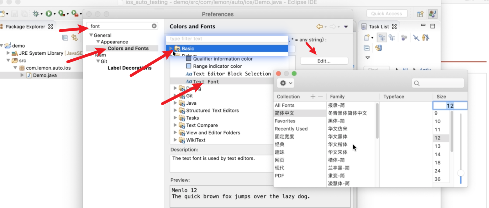

自动触发

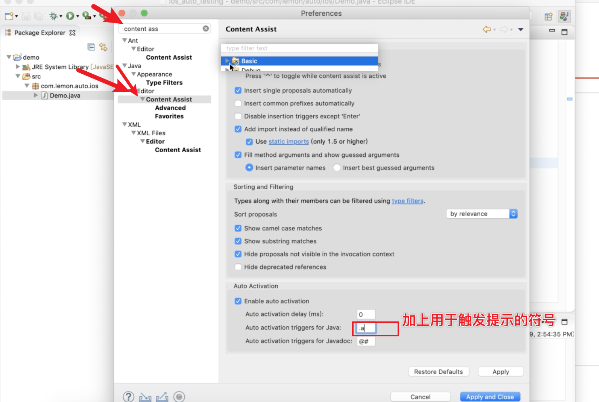

默认编码规则


#### 4.2 maven（java的项目管理工具，提供了很多第三方库

###### eclipse自带的maven

- 如果eclipse集成了maven的话，可以在preferences中找到maven设置

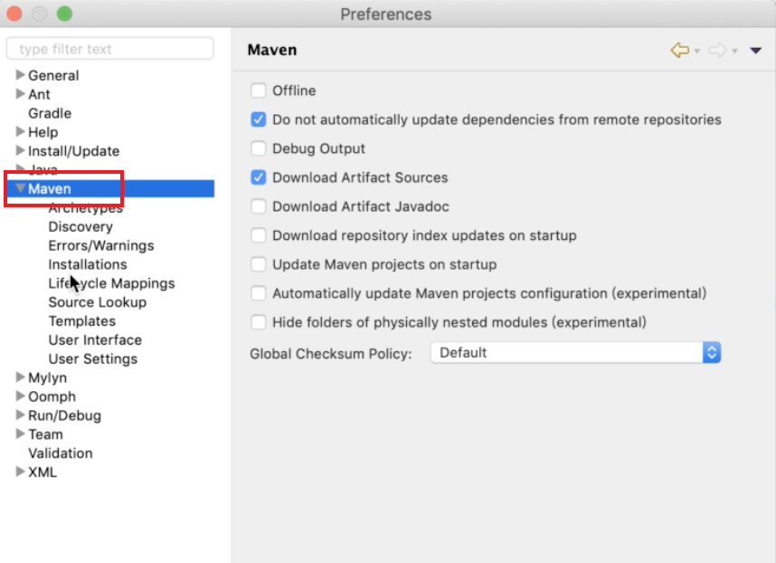

- installations_usersettings

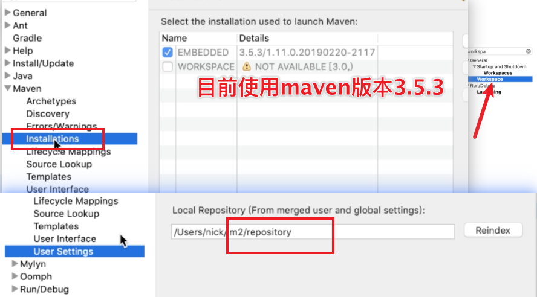

- 创建maven工程

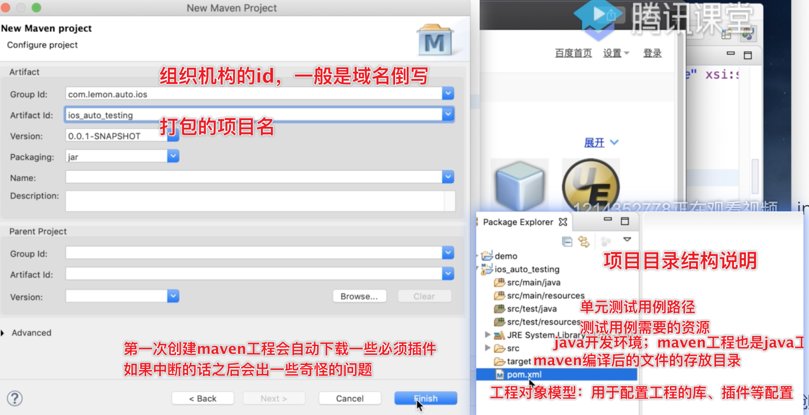

- 引入第三方库

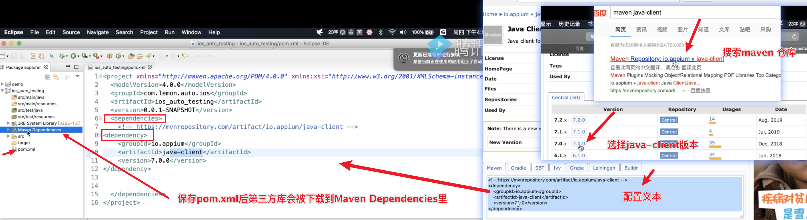

###### 自己安装maven插件（相比于自带的，能自定义maven仓库地址

下载：https: / / maven. Apache org / download. Cgi 

- eclipase集成下载的maven插件，并修改本地仓库（jar包下载到的本地目录

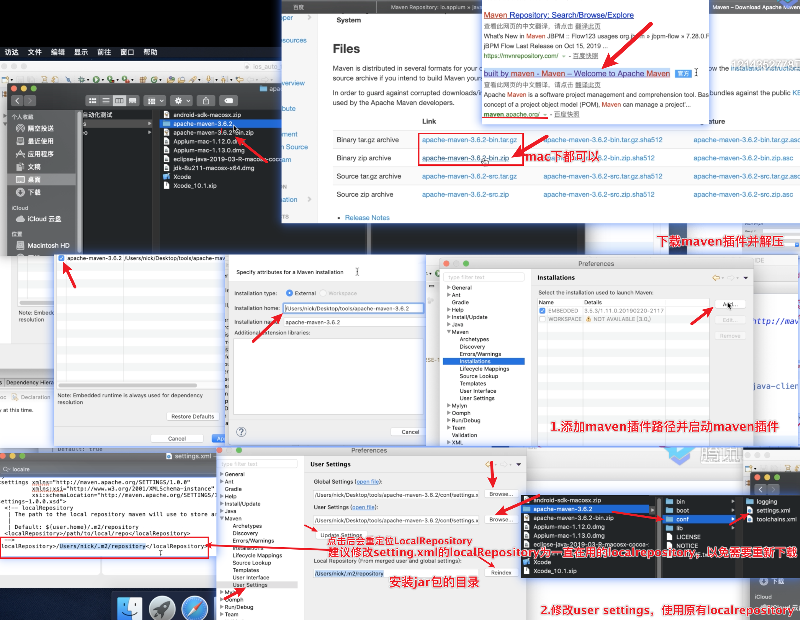

- 修改远程仓库镜像（下载jar包的地址：阿里私服

```xml
<m1ror>
	<id>nexus-aliyun</id>
	<mirrorof>central</mirrorof>
  <name> Nexus aliyun</name>
	<url>http://maven.aliyun.com/nexus/content/groups/public</url>  </mirror>
```

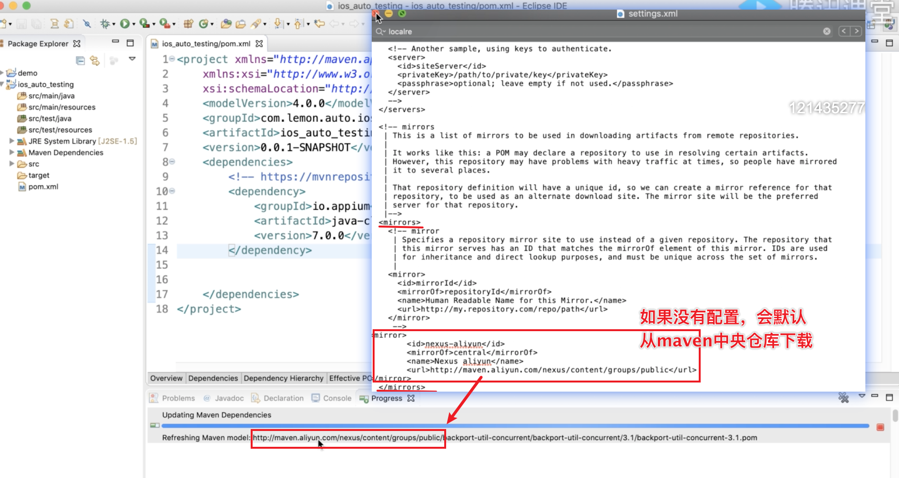

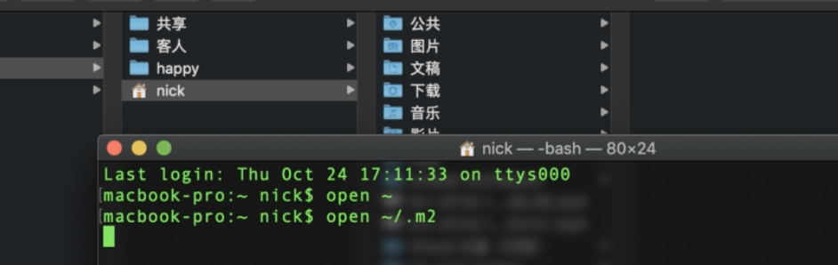

- 配置maven环境变量

```bash
vim ~/.bash_profile
# .bash_profile
MAVEN_HOME=/Users/happy/workspace/program/Apache-maven-3 6.0  PATH=$PATH:$JAVA_HOME/bin:$MAVEN_HOME/bin
export MAVEN_HOME  
export PATH

# 配置生效
source  ~/.bash profile
# 验证
mvn -v
```

#### 4.3 单元测试框架TestNG（其他如Junit

###### eclipse安装TestNG插件

- 菜单栏>Help>Install New Software 
- http://beust.com/eclipse

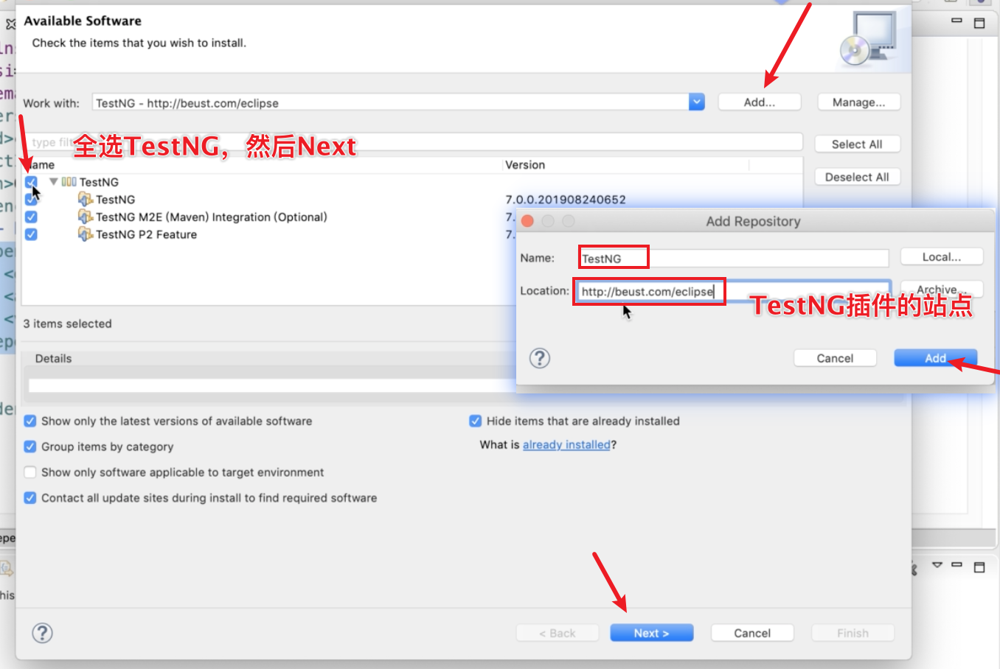

- 重启eclipse

###### 创建testNG的java文件

- test.xml 统一管理测试类和测试方法

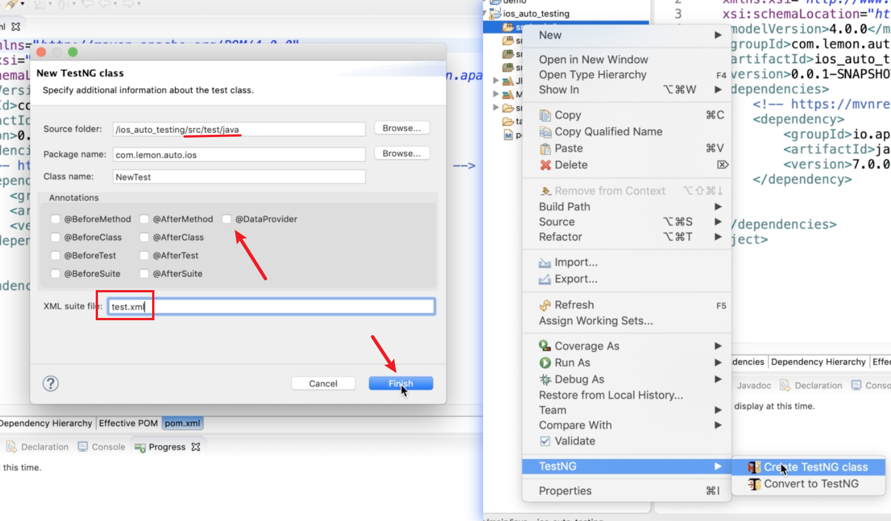

###### 下载testNG的jar包

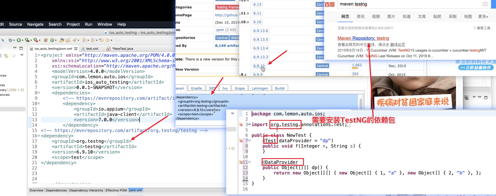


## 五、xcode

###### 下载安装

- app store
- 或者 https://developer.apple.com/download/more/
  - 可以下载各个版本的xcode

- xcode下载各版本模拟器：preference>Compoments

###### 版本需求

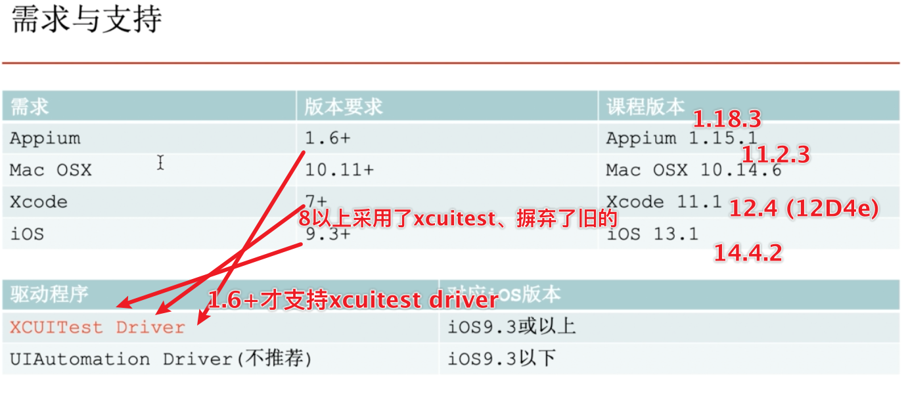


## 六、元素定位

appium-desktop的inspector		

```json
{
"PlatformName": "ios",
"platformVersion": "13.1",
"app": "/Users/nick/Desktop/tools/app/Uicatalog.app",  
"deviceName": "iphone 8"
}
```

