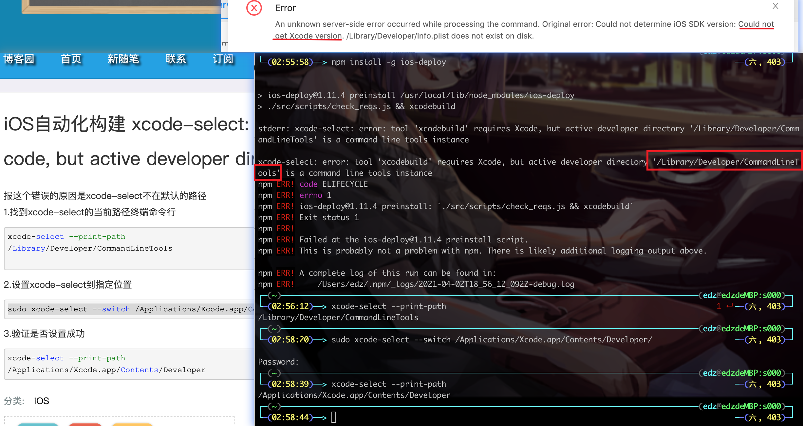
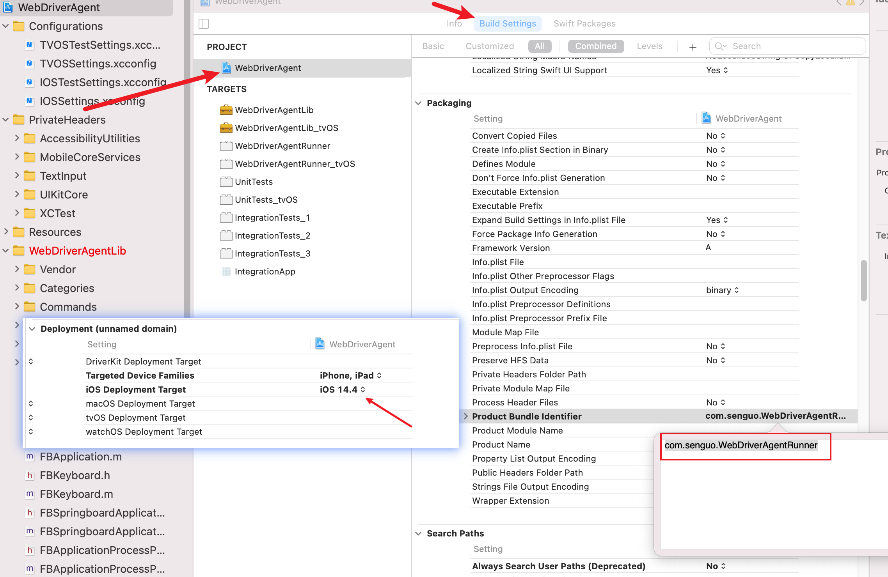
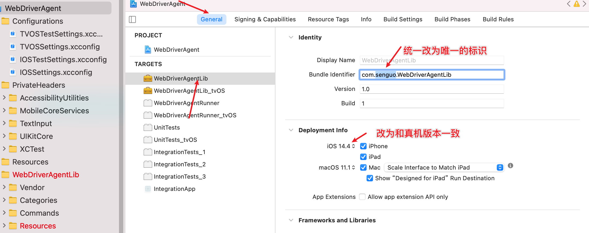
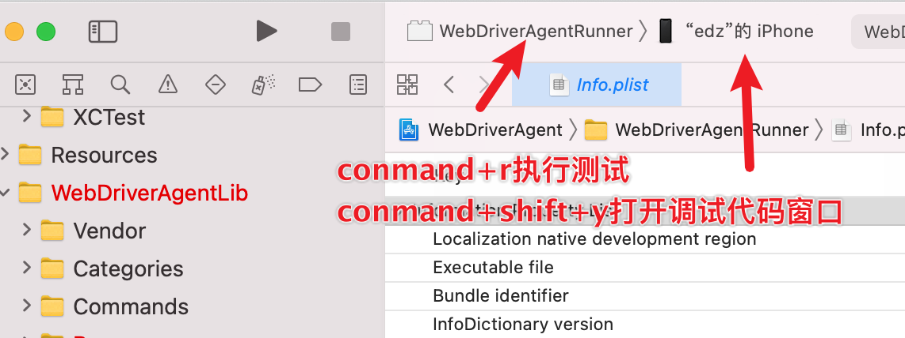

## 一、环境安装

#### 其他资源


- [ ] Apple ID 

  - https://appleid.apple.com/account#!&page=creat
  - 使用xcode真机调试需要登录你的AppleID，要运行ios项目需要将AppleID添加到对应的开发着团队（现在苹果官方好像有所放开了，一些应用没有开发者身份也能运行）
- [ ] 待测试的ios项目

  - 从coding上复制仓库地址克隆下来
- [ ] mac电脑

#### 测试环境

- [ ] java   → https://repo.huaweicloud.com/java/jdk/  注意配置JAVA_HOME环境变量


- [ ] python3.7 → https://www.python.org/ftp/python/
- [ ] pip3    pip 21.0.1 from /usr/local/lib/python3.9/site-packages/pip (python 3.7安装后自带的包管理工具
- [ ] pycharm（python IDE→ https://www.jetbrains.com/pycharm/download，CE即可


- [ ] xcode       (ios应用的ide  Version 12.4 (12D4e)→ mac商店下载
- 快捷键https://www.jianshu.com/p/f5f4e8a3e97c?nomobile=yes

- [ ] brew	

    ```shell
    # max os 的包管理软件，一般maxOS已经自带了
    # 可用macOS自带的ruby安装，推荐版本Homebrew 3.0.5(没试过
    ruby -e "$(curl -fsSL https://raw.githubusercontent.com/Homebrew/install/master/install)"
    ruby <(curl -fsSKL raw.github.com/mxcl/homebrew/go)
    ```
    
- [ ] nvm    （node.js版本管理软件， 

- [ ] node.js    （基于Chrome V8引擎的JS运行环境，主要用它提供的npm
    ```shell
   # 安装nvm
   brew install nvm
   # 然后根据安装成功后打印的信息配置环境变量
   nvm ls-remote     
   # 选择debanium的最新版的node.js
   nvm install 版本号

   # 安装node.js
   # 也可以直接用brew下载node.js
   brew install node
   # node提供了npm工具，不过也可由用brew下载
   brew install npm
   
  ```
  
- [ ] cnpm  (npm限速，可用这个工具替代

    ```shell
    npm install -g cnpm --registry=https://registry.npm.taobao.org
   ```


- [ ] 其他 依赖

  ```shell
  # libimobiledevice (类似Android的adb命令工具，用于真机调试，检索ios设备
  brew install --HEAD libimobiledevice
  
  # ideviceinstaller（获取设备udid、安装卸载app、获取bundleid
  brew install ideviceinstaller
  
  # carthage(第三方库管理工具、WebDriverAgent需要用carthage来自动下载一些内容
  brew install carthage
  
  # ios-deploy（iOS不依赖xcode的调试工具，三选一
  brew install ios-deploy
  cnpm install -g ios-deploy
  npm install -g ios-deploy
  
  # usbmuxd（用于在USB协议上实现多路TCP连接，主要用它提供的iproxy
  brew install usbmuxd
  ```
  
  
  - xcode不在默认路径的解决方法 
    
  - 
  - 安装libimobiledevice依赖项版本太低导致安装失败
  
    ```shell
     # 报错：
     Requested "libusbmuxd> =1. 1. But version of libusbmuxd is 1.0.10 
     # 解决方法
     brew update
     brew uninstall --ignore-dependencies libimobiledevice  
     brew uninstall --ignore-dependencies usbmuxd  
     brew install --HEAD usbmuxd  
     brew unlink usbmuxd  
     brew link usbmuxd
     brew install --HEAD libimobiledevice
    ```

- [ ] appium-doctor    →可以环境测试检查

  ```shell
  # 安装
  npm install -g appium-doctor
  # 使用
  appium-doctor --ios
  ```
  
- [ ] appium-desktop  → https://github.com/appium/appium-desktop/releases

  - 不同版本会有细节的不同导致需要调整相关配置

  - 下载Appium-mac-1.18.3.dmg

    > https://github.com/appium/appium-desktop/releases/tag/v1.18.3

- [ ] WebDriverAgent

  ```shell
  # 进入appium安装目录下WebDriverAgent文件夹（不同版本appium，地址略有不同）
  cd /Applications/Appium.app/Contents/Resources/app/node_modules/appium/node_modules/appium-WebDriverAgent
  
  # 安装依赖
  mkdir -p Resources/WebDriverAgent.bundle
  sh ./Scripts/bootstrap.sh
  # 执行bootstrap可能遇到五花八门的报错，处理方法见https://blog.csdn.net/qq_41030861/article/details/110528139
  
  # 编译
  ```

- 编译WebDriverAgent.xcodeproj：
  
  - 连接真机，使用Xcode打开WebDriverAgent(appium-1.18.3是appium-WebDriverAgent)下的WebDriverAgent.xcodeproj

1. PROJECT：WebDriverAgent的 Product Bundle Identifier、IOS Deployment Target

   

2. TARGETS：WebDriverAgentLib的 系统版本、证书、product identifier

   

   

   

3. TSRGETS：WebDriverAgentRunner的buildsetting 和sign（同2）

4. 文件：WebDriverAgentRunner/info.plist


5. 执行编译test：scheme选WebDriverAgentRunner，destination选真机

   

   - 可能需要手机信任证书：设置>通用>描述文件与设备管理  打开开发者app凭证>点击信任》再次编译
   - 手机上会多一个WebDriverAgent的icon


## 二、常用指令

```shell
# 查看已连接设备的identifier
idevice_id -l
ideviceinfo | grep UniqueDeviceID
ios-deploy -c
# 或者xcode菜单栏》window>Devices And Simulators、
# 或者iTunes已连接的手机

# 查看已安装的包
ios-deploy --id [udid] --list_bundle_id
ios-deploy  --list_bundle_id | grep senguo

# 映射设备端口8100和电脑端口8100 iproxy 电脑 设备
iproxy 8100 8100
# 然后可以在浏览器输入127.0.0.1:8100能查看设备信息，说明环境配置完成，可选择appium 或者Openatx进行测试
```


## 三、资料

- 环境搭建：https://www.jianshu.com/p/38e6d7318ebf

- Iproxy：https://blog.csdn.net/yxys01/article/details/77188976

- xcode编译报错：https://blog.csdn.net/weixin_43291944/article/details/103562488

- WebDriverAgent：https://blog.csdn.net/qq_41030861/article/details/110528139

- libimobiledevice：https://github.com/libimobiledevice/libimobiledevice/blob/master/README.md

  - usbmuxd常用命令

  ```shell
  # 设备管理
  # 列出所有连接的设备的identifier
  idevice_id
  # 显示设备的系统时间
  idevicedate
  ideviceinfo # Show information about a connected device
  idevicename # Display or set the device name
  idevicenotificationproxy # Post or observe notifications on a device
  idevicescreenshot # Gets a screenshot from the connected device
  idevicesetlocation # Simulate location on device
  idevicesyslog # Relay syslog of a connected device
  
  ```

  

- ios-xcuitest-real-devicesmd：

- ios-deploy：https://github.com/ios-control/ios-deploy、

  - ios-deploy常用命令：https://www.jianshu.com/p/86a6163833f8

  ```shell
  # 包管理
  # 查看连接的设备（包括通过usb和wifi连接的）
  ios-deploy -c
  
  # 查看通过usb连接的设备
  ios-deploy -c –no-wifi
  
  # 安装应用到指定设备
  ios-deploy –id[udid] –bundle [xxx.app]
  
  # 卸载指定设备上的应用（根据包名，也就是bundleId）
  ios-deploy --id [udid] --uninstall_only --bundle_id [bundleId]
  
  # 查看指定设备上安装的所有应用（包括系统应用和第三方）
  ios-deploy --id [udid] --list_bundle_id
  
  # 检查指定设备上是否安装了某个应用
  ios-deploy --id [udid] --exists --bundle_id
  
  # 帮助信息
  ios-deploy -h
  # 所有已连接设备安装的包名含有senguo的包
  ios-deploy --list_bundle_id |grep senguo
  ```
```
  
  


```