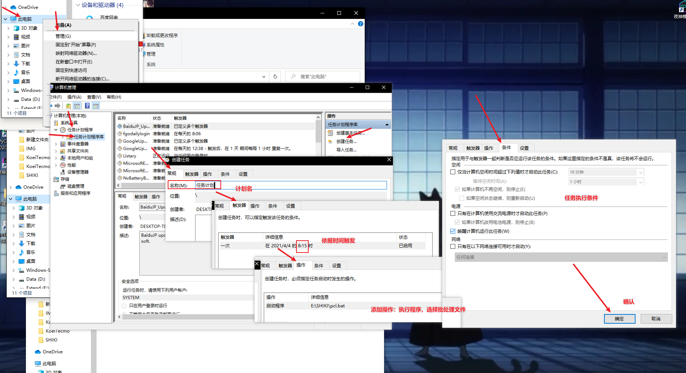
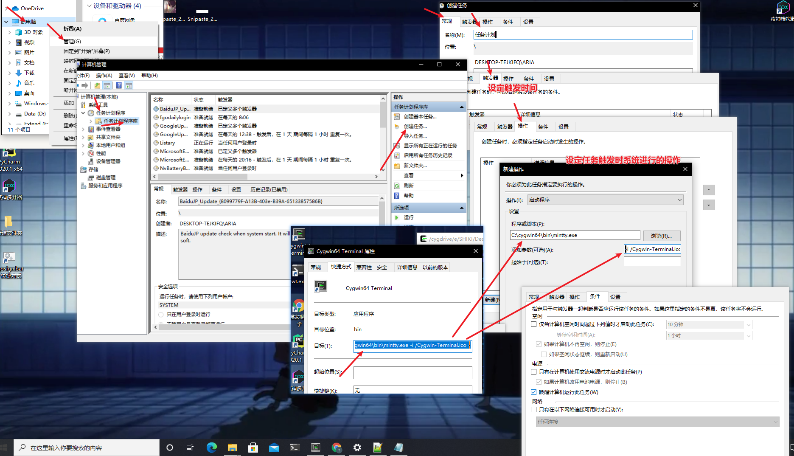
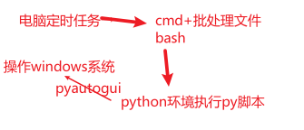

## 一、windows计划任务使用定时执行python脚本

- 方法1：使用windows自带的批处理文件+Windows计划任务

  1. 完成python脚本E:\pyproject\test\[scripts.py](http://scripts.py)，并在cmd命令行里成功执行脚本

  2. 创建批处理文件E:/pcl.bat ,双击批处理文件应该可以正常执行脚本

     ```bash
     @echo off
     E:
     cd pyproject/test
     python scripts.py
     ```

  3. 创建计划任务

  

- 方法2：使用bash终端+Windows计划任务

  1. 完成python脚本E:\pyproject\test\[scripts.py](http://scripts.py)，并在cmd命令行里成功执行脚本
  2. 安装cygwin：https://cygwin.com/          推荐安装插件zsh wget vim git  lynx
  3. 启动bash终端时会执行以此.bash_profile文件中的启动命令，可以将 移动到脚本目录、执行python脚本 的指令写进去

  ```bash
  vim ~/.bash_profile
  # 添加到文件
  alias todir="cd /cygdrive/e/pyproject/test"
  todir && python scripts.py
  
  # 验证：如果执行了脚本则是成功的
  source ~/.bash_profile
  ```

  1. 创建计划任务：直接启用cygwin触发执行py脚本

  

- 使用pyqutogui可以简单的操作windows

  