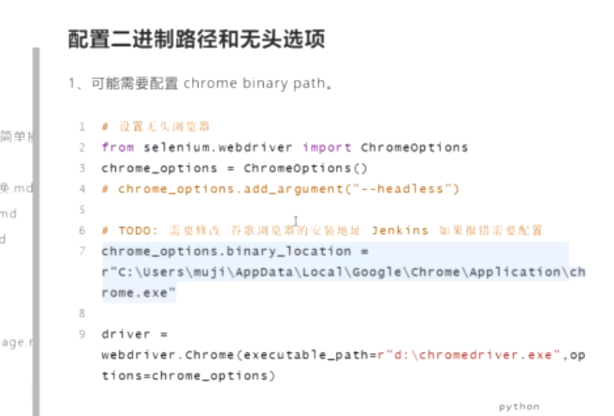
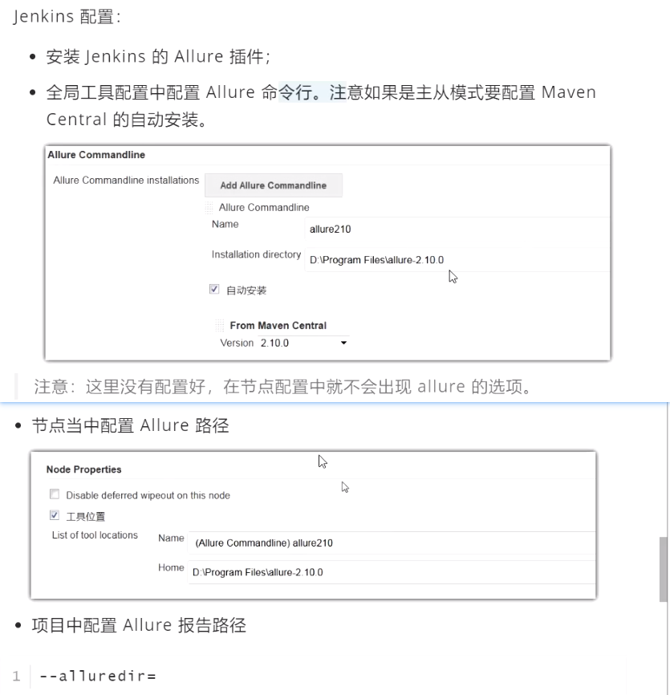

定位失败的原因：

- 表达式不对
- 等待
- iframe、window


## By：

- driver.find_element(by=By.ID, value=None)
  - 能够少错误（少写“硬代码”，根据情况能不写死不写死）
  - 能够提高可读性，如selenium.webdriver.common.keys

- ```python
  from selenium.webdriver.common.by import By
  
  # login_btn_locator = {"by": "class name","value":"btn-special"}  # 登录按钮
  login_btn_locator = {"by": By.CLASS_NAME,"value":"btn-special"}  # 登录按钮
  # password_locator={"by":"name","value":"password"}  # 密码输入框
  password_locator={"by":By.NAME,"value":"password"}  # 密码输入框
  ```

## toast提示
- F12 找到  resources ==> pause 暂停 js 执行。

## web 自动化测试用例实现的流程：
- 1， 准备前置后置， conftest

- 2， 编写测试步骤：测试用例的函数注解， docstring；并手工验证同时准备好需要的locator

- 3， 根据测试步骤封装页面行为。

- 4， 调用页面行为，获取实际结果

- 5， 断言

  ```python
  @pytest.mark.invalid_test
  @pytest.mark.parametrize("test_info",login_invalid)
  def test_login_invalid(self,test_info,fixtrue_driver):
      """登录未授权:
      测试步骤：
          1. 登录页面：输入用户名
          2. 登录页面：输入密码
          3. 登录页面：点击登录
          4. 登录页面：获取登录未授权信息
       """
      login_page = LoginPage(fixtrue_driver)
      actual = login_page.get().login_fail(
          username=test_info["username"],
          password=test_info["password"]
      ).get_invalid_message()
      try:
          assert actual == test_info["expected"]
      except AssertionError as e:
          assert actual == test_info["expected"]
          Handler.logger.error("测试用例不通过")
          raise e
  ```

## 等待
- 显式等待获取元素的封装

  ```python
  def wait_element_visible(self, locator, timeout=2, poll_frequency=0.5):
      """等待某个元素可见,并返回它:
      隐式等待可以等待元素被加载出来，但元素被加载不表示里面动态文本内容能被获取:
      1. 通过显式等待；2. text文本定位；3. 强制等待，把握好时间
      """
  	# 显式等待
  	el=WebDriverWait(
  		self.driver,timeout=timeout,poll_frequency=poll_frequency).until(
          expected_conditions.visibility_of_element_located(locator))  
      # visibility_of_element_located(locator)的locator要用元组或列表, 或者字典.values()
      return el
  ```

- 链式行为跳转页面的等待：

  - 等待：等待下一个页面加载完成

    - 强制等待time.sleep(1)

    - 讨巧：对于固定url的页面可以重新加载该页面.get(). ...

    - 通用：显式等待。

      - 页面加载完成才初始化(init)完成这个页面

      - ```python
        title_contain = "项目详情"
        
        def __init__(self, driver):
            self.driver = driver
            # 等待某个页面加载完成
            try:
                WebDriverWait(self.driver, timeout=5).until(
                    expected_conditions.title_contains(self.title_contain)
                )
            except:
                print("操作可能未进入投标详情页，可能会引发异常".formart(self.title_contain))
      ```
  
  - 检查：检查相邻页面元素定位方式相同（不推荐）

## 复杂用例的前置和测试步骤

- 不一定非要采用web自动化实现前置条件
  - 可以通过接口、修改数据库，手工充值和加标实现
  - 每次执行前自动化充值和加一次标；或者一次性满足条件


## basepage（selenium_handler）封装
思想：类继承

- 页面行为：
  
  - 某个页面特定行为：如定位登录按键、定位未授权提示信息。。。
  - 每个页面通用行为——放在公共页面类basepage中：如等待元素可见的方法，定位一个元素。。。
  
- basepage是每个页面的父类；封装的内容：
  
  - 每个页面的通用方法
  
- 浏览器通用操作的封装：每个页面可以直接调用，不会因项目不同而改变的
  - 截图：装饰器原理：

  ```python
def setfunc(func):
      def wrapper():
        print("1")
          func()
          print("2")
      return wrapper
  
  # @ setfunc   →test1 = setfunc(test1)
  @ setfunc
  def test1():
      print(00)
  
  test1()
  
  def screenshot(func):
      """截图装饰器和错误处理"""
  
      def wrapper(*args, **kwargs):
          try:
              func(*args, **kwargs)
          except Exception as e:
              obj, *args = args
              if not hasattr(obj, "driver"):
                  raise e
              path = config.IMG_PATH
              driver = getattr(obj, "driver")
              ts = datetime.now().strftime("%Y-%m-%d-%H-%M-%S")
              filename = os.path.join(path, ts + ".png")
              driver.maximize_window()
              driver.save_screenshot(filename)
              if not hasattr(obj, "locator"):
                  raise e
              locator = getattr(obj, "locator")
              Handler.logger.error("元素找不到：locator:{}".format(locator))
  
      return wrapper
  ```
  
  - 错误处理：封装basepage的方法：find_element()，用Handler.logger.error捕获异常
  
    ```python
    def find_element(self, locator):
        """查找元素：封装find_element调用日志捕获找不到元素的异常"""
        try:
            el = self.driver.find_element(*locator)
        except:
            Handler.logger.error("元素找不到：{}".format(locator))
    ```


# 注意模块间循环导入类的情况

解决：在函数定义里导入模块，这样在相互调用模块时没有执行函数，从而不会循环导入类


# jenkins集成：

注意cmd启动jenkins服务时要使用管理员运行





## Allure

- 安装 allure 包（用于展示测试报告（提供前端模板和搭建网站服务）），推荐设置环境变量（bin目录）

  - http://allure.qatools.ru/
  - allure ==> selenium-webdriver.exe，?? 核心
  - allure-python ==> pip install selenium  ??

- allure-pytest  :（用于生成pytest的allure模板的测试报告数据文件（json格式））：pip install allure-pytest

  - 执行用例并生成allure报告：pytest.main(["--alluredir=allureout".format(ts), "-m invest_success"])

  ```python
  import pytest
  import datetime
  
  # 注意 datetime 不需要加括号
  ts = datetime.datetime.now().strftime("%Y-%m-%d-%H-%M-%S")
  if __name__ == "__main__":
      pytest.main(["--alluredir=allureout".format(ts), "-m invest_success","-s"]
  ```

  - 查看测试报告(terminal:)：allure serve 报告文件夹allureout
    - 会自动搭建服务并打开浏览器访问该服务，展示目标文件夹的测试报告


- allure报告查看集成到jenkins：

  - jenkins配置：

    - 安装jenkins的Allure插件

    - 全局工具配置中配置Allure命令行。注意如果是主从模式要配置Maven Central的自动安装

      

      

    - pytest -m invest_success --alluredir=allureout

 

## 分布式配置

优点：高并发、高性能

主从配置：主：jenkins服务器；从：其他服务器（个人电脑）

- 搭建节点：

  - jenkins→系统管理→节点管理→新建节点→配置节点，节点机打开节点链接文件slave-agent.jnlp
- 配置项目运行节点，构建项目


# web 自动化重点内容

- xpath。

  - xpath 表达式。 
    - //要写相对路径
    - and 逻辑运算
    - //
    - 索引从一开始，加括号
    - 轴运算。哥哥， 妹妹 
  - xpath 和 css 的对比
    - css更简洁，查找速度快
    - xpath功能强大，支持text文本

- selenium 运行机制, 运行原理

  - 画图。：代码→selenium→webdriver接口→JS指令（浏览器js解释器）→UI行为
  - 什么协议, HTTP
  - 为什么 selenium 可以做到跨语言。
    - webdriver 提供了通过JS操作浏览器的接口（其他语言→JS代码）
  - webdriver 控制浏览器， JS

- 鼠标, ActionChains(driver).click(el).move_to_element(el).perform()

  - perform：让动作生效
  - 链条？：return self,
  - web 自动化测试的框架。PO模式使用链式调用

- 键盘， 类属性：from selenium.webdriver.common import keys

- select， s = Select(el), s.select_by_visible_text, 

- 文件上传, send_keys(),  和系统交互， pywinauto, pyautogui

- JS, execute_script,   arguments[0]

- PO, 什么是 PO 模式，PO 模式有什么作用， PO 封装的原则。

  - pageObject：将页面的元素按页面创建类，按分层设计的思想实现对页面元素的定位和操作的分离，提高自动化代码的可读性（封装的函数、方法，名字可以体现操作），可复用性、可维护性、

- 如何提高web自动化测试的稳定性（提高用例脚本执行成功的概率）

  - 等待。隐式，显示，前置。
  - 元素定位：多用相对路径；不能用动态值和绝对路径。
  - 异常。 异常处理：方便定位出问题的地方
  - 重运行机制。 rerun

  

web 自动化测试的项目：

- 写哪些用例：业务流程的重要性和使用频率、复杂度，在测试计划开始阶段做好评估。

- 什么时候介入web自动化：

  - 老板说什么时候就什么时候；
  - 软件形态和业务稳定之后（web自动化成本大，不适合在软件雏形阶段开始脚本编写。不过计划可以适当提前）
- web 自动化用例的流程。
  - 注释：测试步骤
  - 1， 准备前置
  - 2， 手工测试流程 （元素定位方式放在 PO 当中）
  - 3,  需要封装哪些页面行为。
  - 4， test_ 调用具体的页面行为。

