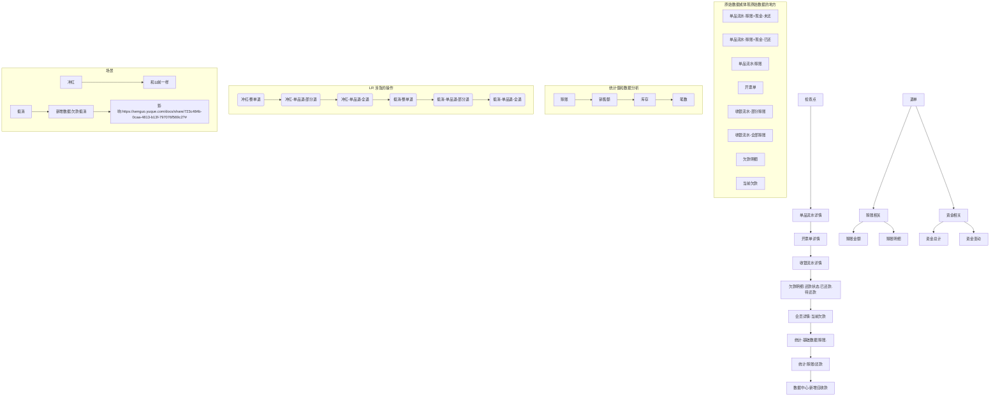

```mermaid
graph TB
	subgraph 原始数据或体现原始数据的地方
	单品流水-赊账+现金-未还
	单品流水-赊账+现金-已还
	单品流水-赊账
	开票单
	收银流水-部分赊账
	收银流水-全部赊账
	欠款明细
	当前欠款
	end
	
	subgraph 统计值和数据分析
	赊账
	-->销售额
	-->库存
	-->笔数
	end
	
	subgraph LR 涉及的操作
	退1(冲红-整单退)
	-->退2(冲红-单品退-部分退)
	-->退3(冲红-单品退-全退)
	-->退4(抵消-整单退)
	-->退5(抵消-单品退-部分退)
	-->退6(抵消-单品退-全退)
	end
	
	检查点
	-->单品流水详情
  -->开票单详情
  -->收银流水详情
	-->欠款明细:还款状态.已还款.待还款
	-->会员详情:当前欠款
	-->统计:基础数据:赊账.
	-->统计:赊账/还款
	-->数据中心:新增应收款
	
	退单-->赊账相关-->赊账金额
	赊账相关-->赊账明细
	退单-->资金相关-->资金总计
	资金相关-->资金变动
	
	subgraph 场景
	冲红-->和以前一样
	抵消-->新增数据:欠款抵消-->影响:https://senguo.yuque.com/docs/share/723c484b-0caa-4813-b13f-797076f569c2?#
	end
	
	
	
	
```

